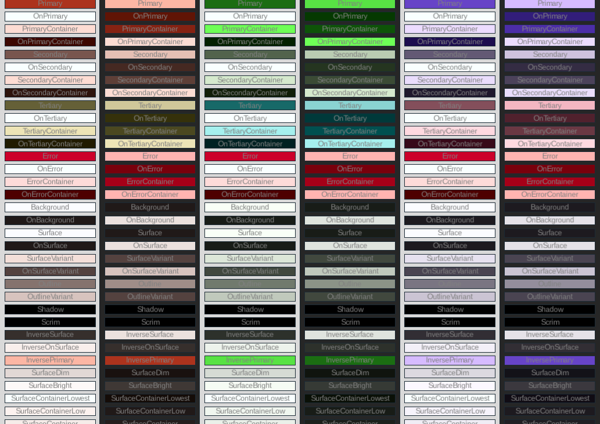
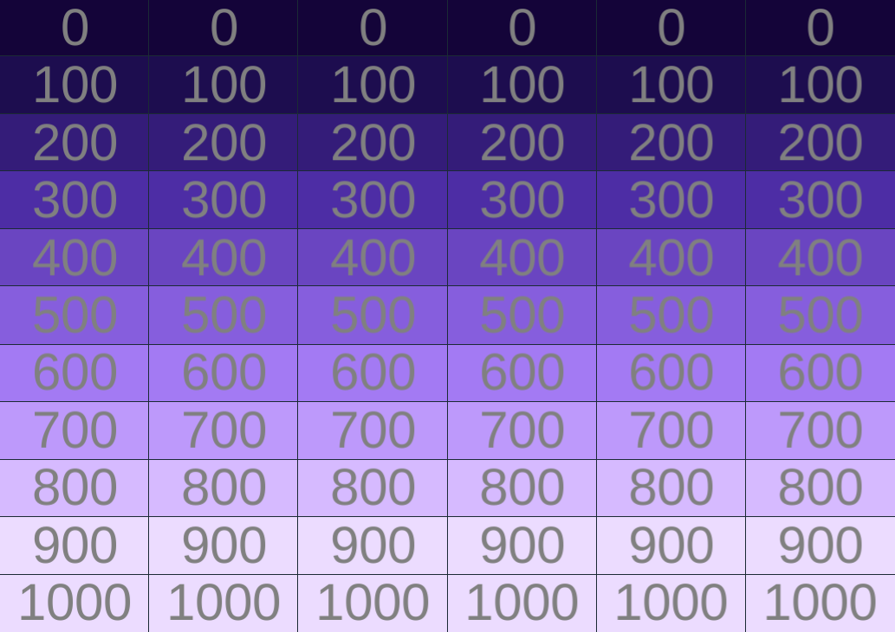

# Synthetic
Synthetic = Fusion created Material

This UI library is powered by a Fusion framework variant, and has the the goal of porting the Google Material Design framework / philosophy to Roblox.

**Disclaimer:** Should not be used in a live game until Roblox releases [Flex functionality](https://devforum.roblox.com/t/new-uilistlayout-flex-features-beta/2694081)

Currently Supports:
- Wrapper / No-Framework
- [Fusion](https://github.com/dphfox/Fusion)
- [Cold-Fusion](https://github.com/nightcycle/cold-fusion)
- [Roact](https://github.com/Roblox/roact/)
<!-- - [React-Lua](https://github.com/Roblox/react-lua) -->
https://github.com/nightcycle/synthetic/assets/77173389/42044196-0b4a-4e76-9276-88edaf60ef55

All components can be previewed with the [Hoarcecat](https://github.com/Kampfkarren/hoarcekat) plugin. Anything named "_Config" showcases the different ways a component can be configured. Anything named "_Theme" showcases how the component looks when made with the more portable theme constructors.

# Install
Depending on the workflow you're using, you'll want to install a specific wally package:
- [No Framework](https://wally.run/package/nightcycle/synthetic-wrapper)
- [Roact](https://wally.run/package/nightcycle/synthetic-roact)
- [Fusion](https://wally.run/package/nightcycle/synthetic-fusion)
- [Cold-Fusion](https://wally.run/package/nightcycle/synthetic-cold-fusion)

If you plan to use multiple frameworks, you can install one containing all [here](https://wally.run/package/nightcycle/synthetic-roact). The one containing all the frameworks is what's used in most documentation.

# Goals

It has been iterated heavily upon since it began in 2020, with its mission statement evolving over time.

## Components Should Be Decoupled
Stylesheet solutions are inevitable, however until we have one that everyone can agree upon (so likely never), the components in this framework shouldn't require the developer buy into a whole ecosystem. If you just need a switch, or a slider, or whatever - you should be able to just take it.

That being said, stylesheet solutions exist for a reason. In the case of Synthetic the compromise was to have all root constructors (aka `.new(...)`) use only native Roblox parameters with the exception of a few simple immutable datatypes that can be created with a single function call.

From there, quality-of-life functions that have far fewer parameters would all fully embrace the framework's styling solution. If this solution ever evolves / gets swapped out with a standardized solution, the base components shouldn't need much refactoring.

## It Should Support All Major Workflows
In the past whenever I see a great UI library, I often find myself torn on whether to use it due to it not integrating cleanly into my workflow.

I use a fairly niche variant of [Fusion](https://github.com/dphfox/Fusion), called [Cold-Fusion](https://github.com/nightcycle/cold-fusion). It's an opinionated Fusion wrapper meant to make things readable by moving away from the functional elegance of Fusion, and towards an OOP direction with memory leak protections in mind. This is the language I wrote Synthetic in.

I've written interface `definition.json` files, allowing for the easy parsing of how the constructors are configured. From then I use a [python script](scripts/compile/run.py) to generate the appropriate ports for them.

## Components Should Strive to Scale Dynamically
The Roblox UI native behavior is a bit messy, with many components with overlapping control fighting for the scale / position of elements on screen. When possible, I would prefer to not get involved in that battle.

As a result, the components are designed to allow for rescaling of the root instance as desired without skewing / breaking the component. There are limits - you can't just make an element infinitely small and expect it to remain usable.

## Type Safety is Non-Negotiable
I love fusion, but the table based method all the constructors use is a headache. There are of course workaround solutions such as [Fusion Autocomplete](https://github.com/VirtualButFake/fusion_autocomplete), however this feels like a band-aid solution to the underlying problem.

I've gone and used parameter dense functions for constructors, relying on the parameter name hinting to guide me. In my experience, this reduces debugging turnaround and leads to faster implementation.


# Components
## Buttons
- [Badge](./src/Component/Button/Badge/README.md)

### Common
- [Elevated](./src/Component/Button/ElevatedButton/README.md)
- [Filled](./src/Component/Button/FilledButton/README.md)
- [Outlined](./src/Component/Button/OutlinedButton/README.md)
- [Text](./src/Component/Button/TextButton/README.md)

### Icons
- [Filled Icon](./src/Component/Button/FilledIconButton/README.md)
- [Outlined Icon](./src/Component/Button/OutlinedIconButton/README.md)

### FAB
- [FAB](./src/Component/Button/FAB/README.md)
- [Extended FAB](./src/Component/Button/ExtendedFAB/README.md)

### Chips
- [Assist Chip](./src/Component/Button/Chip/Assist/README.md)
- [Filter Chip](./src/Component/Button/Chip/Filter/README.md)

## Menu
### Row
- [Segmented](./src/Component/Menu/Row/Segmented/README.md)

### Bar
- [Bottom](./src/Component/Menu/Row/Bar/Bottom/README.md)
- [Top Center](./src/Component/Menu/Row/Bar/Top/Center/README.md)
- [Top Large](./src/Component/Menu/Row/Bar/Top/Large/README.md)
- [Top Medium](./src/Component/Menu/Row/Bar/Top/Medium/README.md)
- [Top Small](./src/Component/Menu/Row/Bar/Top/Small/README.md)

## Text Field
- [Filled](./src/Component/TextField/Filled/README.md)
- [Outlined](./src/Component/TextField/Outlined/README.md)

## Progress Indicator
- [Circular](./src/Component/ProgressIndicator/Circular/README.md)

## Snackbar
- [Small](./src/Component/Snackbar/Small/README.md)
- [Large](./src/Component/Snackbar/Large/README.md)

## Search
- [Filled](./src/Component/Search/Filled/README.md)
- [Text](./src/Component/Search/Filled/README.md)

## Misc
- [Dialog](./src/Component/Dialog/README.md)
- [Checkbox](./src/Component/Checkbox/README.md)
- [Radio Button](./src/Component/RadioButton/README.md)
- [Switch](./src/Component/Switch/README.md)
- [Slider](./src/Component/Slider)


# Style
A lot of UI coding is assigning colors, fonts, and sizing - Synthetic attempts to fix that with a new immutable datatype: "Style". It's immutable due to its intention to be swapped out within states - a case where changes are much more easily detected when the datatype is immutable.

## Usage
Construction:
```luau
-- construct style somewhere
local style = Synthetic.Style.new(
	1, -- scale applied to all components
	Enum.Font.SourceSans -- Enum.Font or Typography type,
	if isDarkMode then Enums.SchemeType.Dark else Enums.SchemeType.Light, -- used for theme engine solver
	color -- the singular color the entire theme should be built around
)
````

Usage:
```luau

-- here's a basic switch
local primarySwitch = Synthetic.Components.Switch.ColdFusion.primary(
	style,
	function(isSelected: boolean)
		print("is selected", isSelected)
	end, -- onSelect
	true, -- initialSelection
)

-- here's a basic switch with all optional parameters
local fullPrimarySwitch = Synthetic.Components.Switch.ColdFusion.primary(
	style,
	function(isSelected: boolean)
		print("is selected", isSelected)
	end, -- onSelect
	true, -- initialSelection,
	true, -- isEnabled
	true, -- includeIconOnSelected
	true -- includeIconOnDeselected
)


-- this constructor can be used without a style state - it's much more verbose / slower to implement
local fullSwitch = Module.ColdFusion.new(
	function(isSelected: boolean?)
		print("is selected", isSelected)
	end, -- onSelect
	true, -- initialSelection
	true, -- isEnabled
	true, -- includeIconOnSelected
	true, -- includeIconOnDeselected
	style:GetColor(Enums.ColorRoleType.SurfaceContainerHighest), -- backgroundColor
	style:GetColor(Enums.ColorRoleType.Outline), -- onBackgroundColor
	style:GetColor(Enums.ColorRoleType.Primary), -- fillColor
	style:GetColor(Enums.ColorRoleType.PrimaryContainer), -- buttonColor
	style:GetColor(Enums.ColorRoleType.OnPrimaryContainer), -- onButtonColor
	style:GetColor(Enums.ColorRoleType.Surface), -- disabledColor
	style:GetColor(Enums.ColorRoleType.OnSurface), -- onDisabledColor
	1, -- elevation
	style.SchemeType, -- schemeType
	style:GetFontData(Enums.FontType.LabelLarge), -- fontData
	style.Scale -- scale
)
```
A style type is mostly composed of two underlying immutable classes: Theme and Typography.

## Theme
Theme is inspired by the philosophy of the [Material Design color role system](https://m3.material.io/styles/color/roles), and powered by a manual port of their [open source color engine](https://github.com/material-foundation/material-color-utilities).

The theme engine is a bit slow due to all the crazy math (~10 ms construction), so it caches the results from prior constructions. This shouldn't be a problem if you're only constructing a handful of these and passing them around, however if you find yourself creating a new one from dynamic input multiple times a second be warned. From my own experience though, since I added caching I haven't noticed any notable performance issues.

### Construction
Should you want to define the theme manually, you can construct one and pass it as a parameter when creating the Style type.
```luau
local source: Color3 = Color3.new(1,0,0)
local customPalette: {[string]: Color3} = {
	RobloxRed = Color3.fromHex("#E2231A"),
}
local theme = Synthetic.Theme.new(
	source,
	customPalette -- can be nil
)
```

### Type Usage

The entire goal of the theme type is to replace hours tinkering with colors, and replace them with a few context relevant tokens. The theme type will then take those tokens and return the appropriate color.
```luau
-- using official color role
local role = "Primary"
local scheme = "Light"
local elevation = 0 -- from (0-6) how much color is modified to appear close to the camera.
local color: Color3 = theme:Get(
	role,
	scheme,
	elevation -- optional, will default to 0
)

-- using custom color role
local customRole = "RobloxRed"
local colorType: "Custom" | "CustomContainer" | "OnCustom" | "OnCustomContainer" = "CustomContainer"

local customColor: Color3 = theme:GetCustom(
	customRole,
	colorType,
	scheme
	elevation
)
```
### Palettes

The theme engine also generates palettes - functions that return a color with a consistent tone, but a brightness level dependent on the provided parameter. If you're interested in going deeper into color customization, you can do so with the palettes.

```luau
local tone: "Primary" | "Secondary" | "Tertiary" | "Neutral" | "NeutralVariant" | "Error" = "Primary"
local isClampEnabled = true -- bright white and pitch black lack a tone, so on default it clamps the values to visually distinct ranges
local brightness = 0.7
local color = style.Palettes[tone](
	brightness,
	isClampEnabled -- optional, defaults to true
)
```

### Interface Usage
If you just want to quickly solve a color's elevation, you can do that without constructing a theme.
```luau
local sourceColor: Color3 = Color3.new(1,0,0)
local elevation: number = 3
local scheme = "Light"
local elevatedColor = Synthetic.Theme.getElevatedColor(sourceColor, elevation, scheme)
```

## Typography
The typography half of the style type is fairly simple. It's basically a dictionary of tokenized use cases as the keys, and FontData as the values.

### FontData
FontData is the immutable data structure that all text appearance related state is stored.
```luau
type FontData = {
	Font: Font, -- the font to apply to the text
	Size: number, -- the pixel height of the typical character
	Tracking: number, -- the letter spacing ratio. 1.0 = monospaced
	LineHeight: number, -- the pixel height of the line + the gap separating it from a neighboring line
}

local fontData = Synthetic.Types.FontData.new(
	Font.fromEnum(Enum.Font.Arial),
	12,
	0.4,
	14
)

```
This data is much easier to pass around across functions. It's used heavily internally, however you're welcome to use it externally if you like.

### Construction
To create a custom typography off of a Roblox font, you can do so like this:
```luau
local font = Font.fromEnum(Enum.Font.Arial)
local typography = Synthetic.Typography.fromFont(font)
```

If you want something more custom, you'll have to define all of the font-data manually
```luau
local typography = Synthetic.Typography.new({
	DisplayLarge = Synthetic.Types.FontData.new(
		Font.fromEnum(Enum.Font.Arial),
		12,
		0.4,
		14
	),
	DisplayMedium = Synthetic.Types.FontData.new(
		Font.fromEnum(Enum.Font.Arial),
		10,
		0.35,
		12
	),
	-- etc
})
```

### Usage
The goal of typography is to quickly provide fontData.
```luau
local fontData = typography:Get("DisplayLarge")
```

### Manual Application
If you aren't sending the fontData as a constructor parameter, you can apply it yourself.
```luau
local fontData = typography:Get("BodySmall")
local scale = 1

local textLabel = Instance.new("TextLabel")
textLabel.TextSize = Synthetic.Typography.getTextSize(fontData.Size, scale),
textLabel.LineHeight = Synthetic.Typography.getGuiLineHeight(fontData.LineHeight, fontData.Size)
textLabel.FontFace = fontData.Font

-- or, if it's just the main text property
Synthetic.Typography.apply(
	textLabel,
	fontData,
	scale -- scale is optional, defaults to 1
)

-- alternatively if you have a Typography type around
typography:Apply(
	textLabel,
	"BodySmall",
	scale -- scale is optional, defaults to 1
)
```

# Sounds
I've gone and uploaded [all the sounds](https://m2.material.io/design/sound/sound-resources.html) made open source by an older version of the Material Design site. They're available as a static dictionary with keys taken from the original file names. They're used throughout the components, however you're welcome to use them as well!

# Icons
All of the google icons are [imported as spritesheets](https://github.com/nightcycle/material-icons), and are recommended to use with this library. They natively support the ImageData type, and are just handy to have around.


# Utility Components
In making this framework, various patterns became apparent. To save code frequent instance use-cases were organized into internal components. You can access them under `Synthetic.Util`.

They're not really meant for developers, however you might find them handy. Currently these aren't translated into other frameworks, however if this is something people find handy then I'll definitely fast-track it.

## Containers
The container interface helps quickly construct invisible frames that scale with the contents. Very handy when dealing with flex hierarchies.

## ImageLabel
Allows for the quick construction of basic icons and images using the ImageData format

## List
Various list constructors, typically more focused on dealing with flex logic.

## Padding
Quickly add scale considerate UIPadding to instances.

## ScrollingContainer
A set of scrolling container constructors that tries to fit whatever you put into it, disappearing into a container if everything fits at once.

## TextLabel
Quickly add labels to things. Includes built in support for icons at beginning / end of text.

# Transitions
The Material Design philosophies on [motion](https://m3.material.io/styles/motion/overview) is a very interesting read - however it's not one that is currently hooked up to most components. However if you do want their expertly curated theories on motion in your game, the Transitions utility may help you.

# Contributing
If you like this framework, please feel free to contribute!

## Bug Fixes / Optimizations / Refactors
Definitely feel free to make pull requests for bug fixes, for the most part I've got no issue with those so long as they don't change any APIs or expected behaviors.

## New Components
Please make an issue before you start working on anything new. For the most part any [Material Design Components](https://m3.material.io/components) are fair game. Please rely on the specs sections of each component to make sure the port properly translates the majority of functionality.

That being said - I recognize Material Design is tackling a slightly different problem than game development, so some components such as proximity prompts, color pickers, etc just don't exist. In the cases where the component is a clear upgrade, I am more than happy to allow for its addition.

New components can be written in non [Cold Fusion](https://github.com/nightcycle/cold-fusion) frameworks, however if you can stomach it, using Cold Fusion is preferred as we want to avoid adding too many translation layers for performance reasons. If you do a fusion variant language, the public facing parameters should all be a `CanBeState<V>` type.


