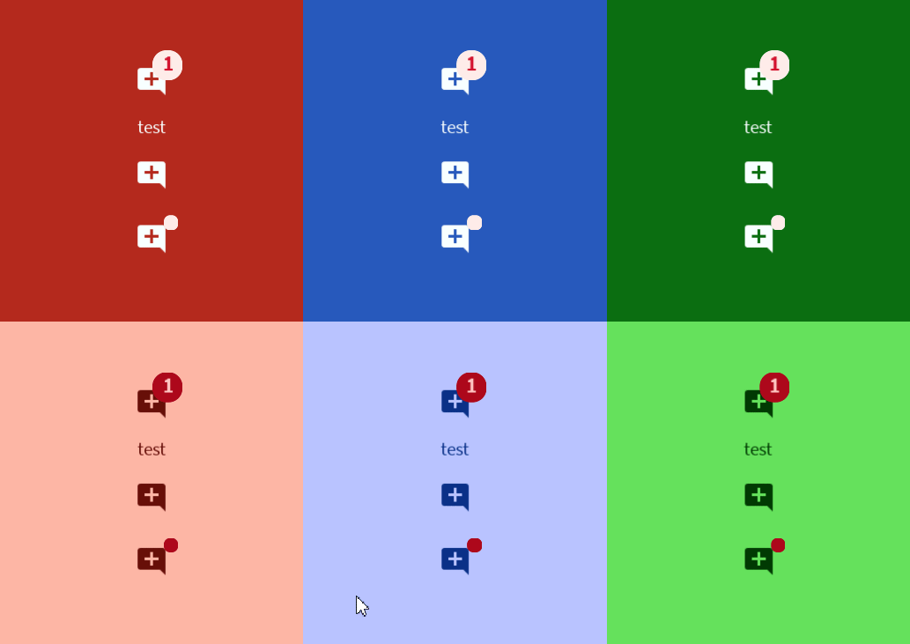

# Badge



A [badge](https://m3.material.io/components/badges/overview) is a small status indicator for UI elements
# Constructors


## new
This function is a native constructor, with verbosity allowing for control over every configurable property at the cost of a less convenient calling.

### Parameters
- **onClick**: () -> ()
- **icon**: ImageData
- **label**: string?
- **count**: number?
- **textColor**: Color3
- **hoverColor**: Color3
- **errorTextColor**: Color3
- **errorBackgroundColor**: Color3
- **elevation**: number
- **schemeType**: Enums.SchemeType
- **fontData**: FontData
- **scale**: number


### Usage

**No Framework**
```luau
local onClick: () -> () = function() end
local icon: ImageData = Types.ImageData.new("")
local label: string? = ""
local count: number? = nil
local textColor: Color3 = Color3.new()
local hoverColor: Color3 = Color3.new()
local errorTextColor: Color3 = Color3.new()
local errorBackgroundColor: Color3 = Color3.new()
local elevation: number = 0
local schemeType: Enums.SchemeType = Enums.SchemeType.Light
local fontData: FontData = Types.FontData.new(Font.fromEnum(Enum.Font.SourceSans), 14)
local scale: number = 1

local badge = Synthetic.Component.Button.Badge.Fusion.new()
badge.OnClick = onClick
badge.Icon = icon
badge.Label = label
badge.Count = count
badge.TextColor = textColor
badge.HoverColor = hoverColor
badge.ErrorTextColor = errorTextColor
badge.ErrorBackgroundColor = errorBackgroundColor
badge.Elevation = elevation
badge.SchemeType = schemeType
badge.FontData = fontData
badge.Scale = scale
```

**Fusion**
```luau
local onClickState: Fusion.Value<() -> ()> = Value(function() end)
local icon: ImageData = Types.ImageData.new("")
local labelState: Fusion.Value<string?> = Value("")
local count: number? = nil
local textColorState: Fusion.Value<Color3> = Value(Color3.new())
local hoverColor: Color3 = Color3.new()
local errorTextColorState: Fusion.Value<Color3> = Value(Color3.new())
local errorBackgroundColor: Color3 = Color3.new()
local elevationState: Fusion.Value<number> = Value(0)
local schemeType: Enums.SchemeType = Enums.SchemeType.Light
local fontDataState: Fusion.Value<FontData> = Value(Types.FontData.new(Font.fromEnum(Enum.Font.SourceSans), 14))
local scale: number = 1

local badge: GuiObject = Synthetic.Component.Button.Badge.Fusion.new(
	onClickState,
	icon,
	labelState,
	count,
	textColorState,
	hoverColor,
	errorTextColorState,
	errorBackgroundColor,
	elevationState,
	schemeType,
	fontDataState,
	scale
)
```

**Roact**
```luau
local badge = Roact.createElement(Module.Roact.New, {
	onClick = function() end,
	icon = Types.ImageData.new(""),
	label = "",
	count = nil,
	textColor = Color3.new(),
	hoverColor = Color3.new(),
	errorTextColor = Color3.new(),
	errorBackgroundColor = Color3.new(),
	elevation = 0,
	schemeType = Enums.SchemeType.Light,
	fontData = Types.FontData.new(Font.fromEnum(Enum.Font.SourceSans), 14),
	scale = 1,
})

Roact.mount(badge, parent)
```
## onPrimary / onSurface
This function is a style constructor, utilizing the "Style" type to reduce the number of parameters required for implementation.

### Parameters
- **style**: Style
- **onClick**: () -> ()
- **icon**: ImageData
- **label**: string?
- **count**: number?
- **elevation**: number?


### Usage

**No Framework**
```luau
local style: Style = Style.new(1, Enum.Font.SourceSans, "Light", Color3.new(0, 0.4, 0.7))
local onClick: () -> () = function() end
local icon: ImageData = Types.ImageData.new("")
local label: string? = ""
local count: number? = nil
local elevation: number? = 0

local badge = Synthetic.Component.Button.Badge.Fusion.onPrimary()
badge.Style = style
badge.OnClick = onClick
badge.Icon = icon
badge.Label = label
badge.Count = count
badge.Elevation = elevation
```

**Fusion**
```luau
local styleState: Fusion.Value<Style> = Value(Style.new(1, Enum.Font.SourceSans, "Light", Color3.new(0, 0.4, 0.7)))
local onClick: () -> () = function() end
local iconState: Fusion.Value<ImageData> = Value(Types.ImageData.new(""))
local label: string? = ""
local countState: Fusion.Value<number?> = Value(nil)
local elevation: number? = 0

local badge: GuiObject = Synthetic.Component.Button.Badge.Fusion.onPrimary(
	styleState,
	onClick,
	iconState,
	label,
	countState,
	elevation
)
```

**Roact**
```luau
local badge = Roact.createElement(Module.Roact.OnPrimary, {
	style = Style.new(1, Enum.Font.SourceSans, "Light", Color3.new(0, 0.4, 0.7)),
	onClick = function() end,
	icon = Types.ImageData.new(""),
	label = "",
	count = nil,
	elevation = 0,
})

Roact.mount(badge, parent)
```