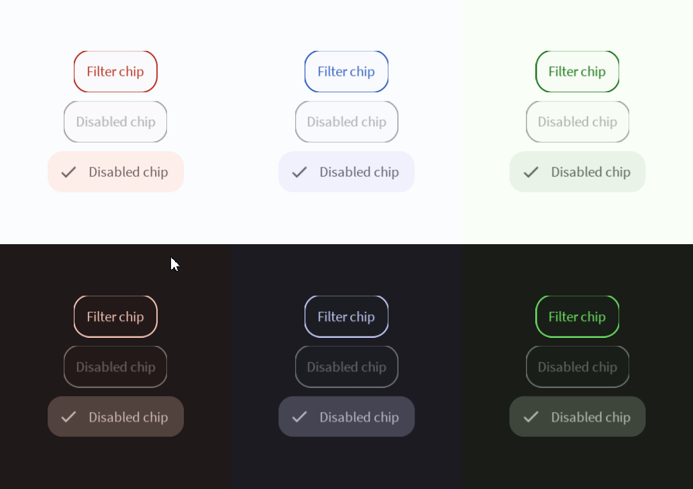

# Elevated Button



An elevated button is like a filled button, but there's a light shadow under it. Read more [here](https://m3.material.io/components/buttons/overview).
# Constructors


## new
This function is a native constructor, with verbosity allowing for control over every configurable property at the cost of a less convenient calling.

### Parameters
- **onClick**: () -> () = This function is called on click.
- **text**: string
- **icon**: ImageData?
- **textColor**: Color3
- **surfaceColor**: Color3
- **disabledTextColor**: Color3
- **disabledSurfaceColor**: Color3
- **shadowColor**: Color3
- **isEnabled**: boolean
- **elevation**: number
- **schemeType**: Enums.SchemeType
- **fontData**: FontData
- **scale**: number


### Usage

**No Framework**
```luau
local onClick: () -> () = function() end -- calls function on click
local text: string = "Button"
local icon: ImageData? = nil
local textColor: Color3 = Color3.new()
local surfaceColor: Color3 = Color3.new()
local disabledTextColor: Color3 = Color3.new()
local disabledSurfaceColor: Color3 = Color3.new()
local shadowColor: Color3 = Color3.new()
local isEnabled: boolean = true
local elevation: number = 0
local schemeType: Enums.SchemeType = Enums.SchemeType.Light
local fontData: FontData = Types.FontData.new(Font.fromEnum(Enum.Font.SourceSans), 14)
local scale: number = 1

local elevatedButton = Synthetic.Component.Button.ElevatedButton.Wrapper.new()
elevatedButton.OnClick = onClick
elevatedButton.Text = text
elevatedButton.Icon = icon
elevatedButton.TextColor = textColor
elevatedButton.SurfaceColor = surfaceColor
elevatedButton.DisabledTextColor = disabledTextColor
elevatedButton.DisabledSurfaceColor = disabledSurfaceColor
elevatedButton.ShadowColor = shadowColor
elevatedButton.IsEnabled = isEnabled
elevatedButton.Elevation = elevation
elevatedButton.SchemeType = schemeType
elevatedButton.FontData = fontData
elevatedButton.Scale = scale
```

**Fusion**
```luau
local onClickState: Fusion.Value<() -> ()> = Value(function() end) -- calls function on click
local text: string = "Button"
local iconState: Fusion.Value<ImageData?> = Value(nil)
local textColor: Color3 = Color3.new()
local surfaceColorState: Fusion.Value<Color3> = Value(Color3.new())
local disabledTextColor: Color3 = Color3.new()
local disabledSurfaceColorState: Fusion.Value<Color3> = Value(Color3.new())
local shadowColor: Color3 = Color3.new()
local isEnabledState: Fusion.Value<boolean> = Value(true)
local elevation: number = 0
local schemeTypeState: Fusion.Value<Enums.SchemeType> = Value(Enums.SchemeType.Light)
local fontData: FontData = Types.FontData.new(Font.fromEnum(Enum.Font.SourceSans), 14)
local scaleState: Fusion.Value<number> = Value(1)

local elevatedButton: GuiObject = Synthetic.Component.Button.ElevatedButton.Fusion.new(
	onClickState,
	text,
	iconState,
	textColor,
	surfaceColorState,
	disabledTextColor,
	disabledSurfaceColorState,
	shadowColor,
	isEnabledState,
	elevation,
	schemeTypeState,
	fontData,
	scaleState
)
```

**Roact**
```luau
local elevatedButton = Roact.createElement(Module.Roact.New, {
	onClick = function() end, -- calls function on click
	text = "Button",
	icon = nil,
	textColor = Color3.new(),
	surfaceColor = Color3.new(),
	disabledTextColor = Color3.new(),
	disabledSurfaceColor = Color3.new(),
	shadowColor = Color3.new(),
	isEnabled = true,
	elevation = 0,
	schemeType = Enums.SchemeType.Light,
	fontData = Types.FontData.new(Font.fromEnum(Enum.Font.SourceSans), 14),
	scale = 1,
})

Roact.mount(elevatedButton, parent)
```
## primary / secondary / tertiary / primaryContainer / secondaryContainer / tertiaryContainer
This function is a style constructor, utilizing the "Style" type to reduce the number of parameters required for implementation.

### Parameters
- **style**: Style
- **onClick**: () -> () = This function is called on click.
- **text**: string
- **icon**: ImageData?
- **elevation**: number
- **isEnabled**: boolean


### Usage

**No Framework**
```luau
local style: Style = Style.new(1, Enum.Font.SourceSans, "Light", Color3.new(0, 0.4, 0.7))
local onClick: () -> () = function() end -- calls function on click
local text: string = "Button"
local icon: ImageData? = nil
local elevation: number = 0
local isEnabled: boolean = true

local elevatedButton = Synthetic.Component.Button.ElevatedButton.Wrapper.primary()
elevatedButton.Style = style
elevatedButton.OnClick = onClick
elevatedButton.Text = text
elevatedButton.Icon = icon
elevatedButton.Elevation = elevation
elevatedButton.IsEnabled = isEnabled
```

**Fusion**
```luau
local styleState: Fusion.Value<Style> = Value(Style.new(1, Enum.Font.SourceSans, "Light", Color3.new(0, 0.4, 0.7)))
local onClick: () -> () = function() end -- calls function on click
local textState: Fusion.Value<string> = Value("Button")
local icon: ImageData? = nil
local elevationState: Fusion.Value<number> = Value(0)
local isEnabled: boolean = true

local elevatedButton: GuiObject = Synthetic.Component.Button.ElevatedButton.Fusion.primary(
	styleState,
	onClick,
	textState,
	icon,
	elevationState,
	isEnabled
)
```

**Roact**
```luau
local elevatedButton = Roact.createElement(Module.Roact.Primary, {
	style = Style.new(1, Enum.Font.SourceSans, "Light", Color3.new(0, 0.4, 0.7)),
	onClick = function() end, -- calls function on click
	text = "Button",
	icon = nil,
	elevation = 0,
	isEnabled = true,
})

Roact.mount(elevatedButton, parent)
```