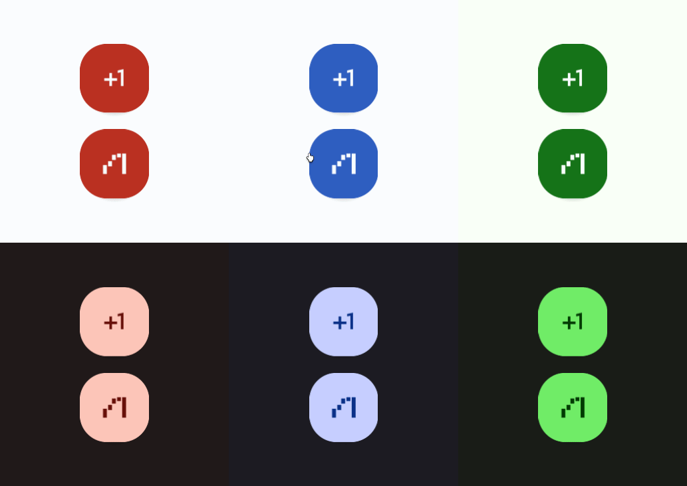

# FAB



A "Floating-Action-Button" (FAB) is a large filled icon button that hovers above the other UI elements. Read more [here](https://m3.material.io/components/floating-action-button/overview).
# Constructors


## new
This function is a native constructor, with verbosity allowing for control over every configurable property at the cost of a less convenient calling.

### Parameters
- **onClick**: () -> () = This function is called on click.
- **icon**: ImageData
- **textColor**: Color3
- **surfaceColor**: Color3
- **disabledTextColor**: Color3
- **disabledSurfaceColor**: Color3
- **shadowColor**: Color3
- **isEnabled**: boolean
- **elevation**: number
- **schemeType**: Enums.SchemeType
- **fontData**: FontData
- **scale**: number


### Usage

**No Framework**
```luau
local onClick: () -> () = function() end -- calls function on click
local icon: ImageData = Types.ImageData.new("")
local textColor: Color3 = Color3.new()
local surfaceColor: Color3 = Color3.new()
local disabledTextColor: Color3 = Color3.new()
local disabledSurfaceColor: Color3 = Color3.new()
local shadowColor: Color3 = Color3.new()
local isEnabled: boolean = true
local elevation: number = 0
local schemeType: Enums.SchemeType = Enums.SchemeType.Light
local fontData: FontData = Types.FontData.new(Font.fromEnum(Enum.Font.SourceSans), 14)
local scale: number = 1

local fAB = Synthetic.Component.Button.FAB.Wrapper.new()
fAB.OnClick = onClick
fAB.Icon = icon
fAB.TextColor = textColor
fAB.SurfaceColor = surfaceColor
fAB.DisabledTextColor = disabledTextColor
fAB.DisabledSurfaceColor = disabledSurfaceColor
fAB.ShadowColor = shadowColor
fAB.IsEnabled = isEnabled
fAB.Elevation = elevation
fAB.SchemeType = schemeType
fAB.FontData = fontData
fAB.Scale = scale
```

**Fusion**
```luau
local onClickState: Fusion.Value<() -> ()> = Value(function() end) -- calls function on click
local icon: ImageData = Types.ImageData.new("")
local textColorState: Fusion.Value<Color3> = Value(Color3.new())
local surfaceColor: Color3 = Color3.new()
local disabledTextColorState: Fusion.Value<Color3> = Value(Color3.new())
local disabledSurfaceColor: Color3 = Color3.new()
local shadowColorState: Fusion.Value<Color3> = Value(Color3.new())
local isEnabled: boolean = true
local elevationState: Fusion.Value<number> = Value(0)
local schemeType: Enums.SchemeType = Enums.SchemeType.Light
local fontDataState: Fusion.Value<FontData> = Value(Types.FontData.new(Font.fromEnum(Enum.Font.SourceSans), 14))
local scale: number = 1

local fAB: GuiObject = Synthetic.Component.Button.FAB.Fusion.new(
	onClickState,
	icon,
	textColorState,
	surfaceColor,
	disabledTextColorState,
	disabledSurfaceColor,
	shadowColorState,
	isEnabled,
	elevationState,
	schemeType,
	fontDataState,
	scale
)
```

**Roact**
```luau
local fAB = Roact.createElement(Module.Roact.New, {
	onClick = function() end, -- calls function on click
	icon = Types.ImageData.new(""),
	textColor = Color3.new(),
	surfaceColor = Color3.new(),
	disabledTextColor = Color3.new(),
	disabledSurfaceColor = Color3.new(),
	shadowColor = Color3.new(),
	isEnabled = true,
	elevation = 0,
	schemeType = Enums.SchemeType.Light,
	fontData = Types.FontData.new(Font.fromEnum(Enum.Font.SourceSans), 14),
	scale = 1,
})

Roact.mount(fAB, parent)
```
## primary / secondary / tertiary / primaryContainer / secondaryContainer / tertiaryContainer
This function is a style constructor, utilizing the "Style" type to reduce the number of parameters required for implementation.

### Parameters
- **style**: Style
- **onClick**: () -> () = This function is called on click.
- **icon**: ImageData
- **elevation**: number
- **isEnabled**: boolean


### Usage

**No Framework**
```luau
local style: Style = Style.new(1, Enum.Font.SourceSans, "Light", Color3.new(0, 0.4, 0.7))
local onClick: () -> () = function() end -- calls function on click
local icon: ImageData = Types.ImageData.new("")
local elevation: number = 0
local isEnabled: boolean = true

local fAB = Synthetic.Component.Button.FAB.Wrapper.primary()
fAB.Style = style
fAB.OnClick = onClick
fAB.Icon = icon
fAB.Elevation = elevation
fAB.IsEnabled = isEnabled
```

**Fusion**
```luau
local styleState: Fusion.Value<Style> = Value(Style.new(1, Enum.Font.SourceSans, "Light", Color3.new(0, 0.4, 0.7)))
local onClick: () -> () = function() end -- calls function on click
local iconState: Fusion.Value<ImageData> = Value(Types.ImageData.new(""))
local elevation: number = 0
local isEnabledState: Fusion.Value<boolean> = Value(true)

local fAB: GuiObject = Synthetic.Component.Button.FAB.Fusion.primary(
	styleState,
	onClick,
	iconState,
	elevation,
	isEnabledState
)
```

**Roact**
```luau
local fAB = Roact.createElement(Module.Roact.Primary, {
	style = Style.new(1, Enum.Font.SourceSans, "Light", Color3.new(0, 0.4, 0.7)),
	onClick = function() end, -- calls function on click
	icon = Types.ImageData.new(""),
	elevation = 0,
	isEnabled = true,
})

Roact.mount(fAB, parent)
```