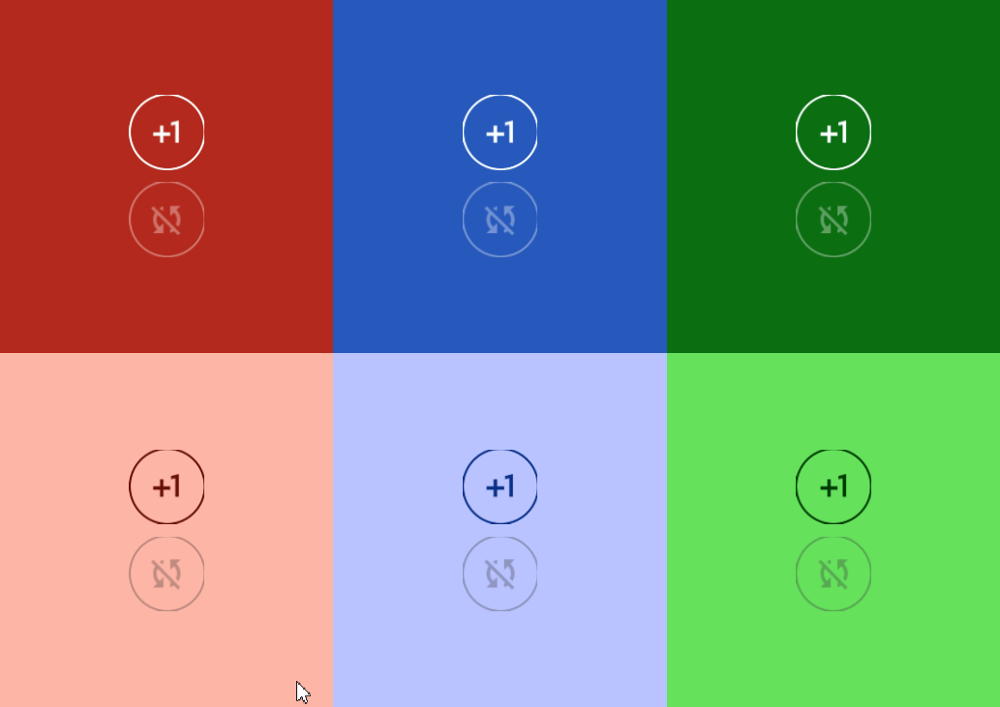

# Outlined Icon Button




# Constructors


## new
This function is a native constructor, with verbosity allowing for control over every configurable property at the cost of a less convenient calling.

### Parameters
- **onClick**: () -> () = This function is called on click.
- **icon**: ImageData
- **textColor**: Color3
- **disabledTextColor**: Color3
- **isEnabled**: boolean
- **elevation**: number
- **schemeType**: Enums.SchemeType
- **fontData**: FontData
- **scale**: number


### Usage

**No Framework**
```luau
local onClick: () -> () = function() end -- calls function on click
local icon: ImageData = Types.ImageData.new("")
local textColor: Color3 = Color3.new()
local disabledTextColor: Color3 = Color3.new()
local isEnabled: boolean = true
local elevation: number = 0
local schemeType: Enums.SchemeType = Enums.SchemeType.Light
local fontData: FontData = Types.FontData.new(Font.fromEnum(Enum.Font.SourceSans), 14)
local scale: number = 1

local outlinedIconButton = Synthetic.Component.Button.OutlinedIconButton.Wrapper.new()
outlinedIconButton.OnClick = onClick
outlinedIconButton.Icon = icon
outlinedIconButton.TextColor = textColor
outlinedIconButton.DisabledTextColor = disabledTextColor
outlinedIconButton.IsEnabled = isEnabled
outlinedIconButton.Elevation = elevation
outlinedIconButton.SchemeType = schemeType
outlinedIconButton.FontData = fontData
outlinedIconButton.Scale = scale
```

**Fusion**
```luau
local onClickState: Fusion.Value<() -> ()> = Value(function() end) -- calls function on click
local icon: ImageData = Types.ImageData.new("")
local textColorState: Fusion.Value<Color3> = Value(Color3.new())
local disabledTextColor: Color3 = Color3.new()
local isEnabledState: Fusion.Value<boolean> = Value(true)
local elevation: number = 0
local schemeTypeState: Fusion.Value<Enums.SchemeType> = Value(Enums.SchemeType.Light)
local fontData: FontData = Types.FontData.new(Font.fromEnum(Enum.Font.SourceSans), 14)
local scaleState: Fusion.Value<number> = Value(1)

local outlinedIconButton: GuiObject = Synthetic.Component.Button.OutlinedIconButton.Fusion.new(
	onClickState,
	icon,
	textColorState,
	disabledTextColor,
	isEnabledState,
	elevation,
	schemeTypeState,
	fontData,
	scaleState
)
```

**Roact**
```luau
local outlinedIconButton = Roact.createElement(Module.Roact.New, {
	onClick = function() end, -- calls function on click
	icon = Types.ImageData.new(""),
	textColor = Color3.new(),
	disabledTextColor = Color3.new(),
	isEnabled = true,
	elevation = 0,
	schemeType = Enums.SchemeType.Light,
	fontData = Types.FontData.new(Font.fromEnum(Enum.Font.SourceSans), 14),
	scale = 1,
})

Roact.mount(outlinedIconButton, parent)
```
## onPrimary / onSecondary / onTertiary / onPrimaryContainer / onSecondaryContainer / onTertiaryContainer
This function is a style constructor, utilizing the "Style" type to reduce the number of parameters required for implementation.

### Parameters
- **style**: Style
- **onClick**: () -> () = This function is called on click.
- **icon**: ImageData
- **elevation**: number
- **isEnabled**: boolean


### Usage

**No Framework**
```luau
local style: Style = Style.new(1, Enum.Font.SourceSans, "Light", Color3.new(0, 0.4, 0.7))
local onClick: () -> () = function() end -- calls function on click
local icon: ImageData = Types.ImageData.new("")
local elevation: number = 0
local isEnabled: boolean = true

local outlinedIconButton = Synthetic.Component.Button.OutlinedIconButton.Wrapper.onPrimary()
outlinedIconButton.Style = style
outlinedIconButton.OnClick = onClick
outlinedIconButton.Icon = icon
outlinedIconButton.Elevation = elevation
outlinedIconButton.IsEnabled = isEnabled
```

**Fusion**
```luau
local styleState: Fusion.Value<Style> = Value(Style.new(1, Enum.Font.SourceSans, "Light", Color3.new(0, 0.4, 0.7)))
local onClick: () -> () = function() end -- calls function on click
local iconState: Fusion.Value<ImageData> = Value(Types.ImageData.new(""))
local elevation: number = 0
local isEnabledState: Fusion.Value<boolean> = Value(true)

local outlinedIconButton: GuiObject = Synthetic.Component.Button.OutlinedIconButton.Fusion.onPrimary(
	styleState,
	onClick,
	iconState,
	elevation,
	isEnabledState
)
```

**Roact**
```luau
local outlinedIconButton = Roact.createElement(Module.Roact.OnPrimary, {
	style = Style.new(1, Enum.Font.SourceSans, "Light", Color3.new(0, 0.4, 0.7)),
	onClick = function() end, -- calls function on click
	icon = Types.ImageData.new(""),
	elevation = 0,
	isEnabled = true,
})

Roact.mount(outlinedIconButton, parent)
```