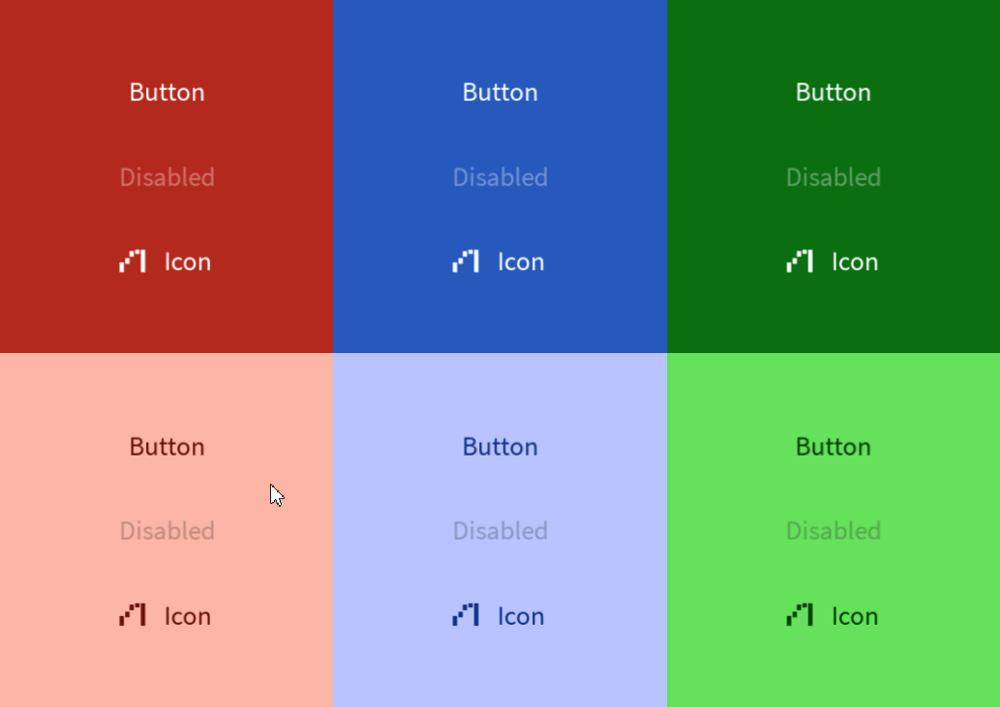

# Text Button



A text button is a simple interactive label which can be clicked for an action. Read more [here](https://m3.material.io/components/buttons/overview).
# Constructors


## new
This function is a native constructor, with verbosity allowing for control over every configurable property at the cost of a less convenient calling.

### Parameters
- **onClick**: () -> ()
- **text**: string
- **icon**: ImageData?
- **textColor**: Color3
- **disabledTextColor**: Color3
- **isEnabled**: boolean
- **elevation**: number
- **schemeType**: Enums.SchemeType
- **fontData**: FontData
- **scale**: number


### Usage

**No Framework**
```luau
local onClick: () -> () = function() end
local text: string = "Button"
local icon: ImageData? = nil
local textColor: Color3 = Color3.new()
local disabledTextColor: Color3 = Color3.new()
local isEnabled: boolean = true
local elevation: number = 0
local schemeType: Enums.SchemeType = Enums.SchemeType.Light
local fontData: FontData = Types.FontData.new(Font.fromEnum(Enum.Font.SourceSans), 14)
local scale: number = 1

local textButton = Synthetic.Component.Button.TextButton.Fusion.new()
textButton.OnClick = onClick
textButton.Text = text
textButton.Icon = icon
textButton.TextColor = textColor
textButton.DisabledTextColor = disabledTextColor
textButton.IsEnabled = isEnabled
textButton.Elevation = elevation
textButton.SchemeType = schemeType
textButton.FontData = fontData
textButton.Scale = scale
```

**Fusion**
```luau
local onClickState: Fusion.Value<() -> ()> = Value(function() end)
local text: string = "Button"
local iconState: Fusion.Value<ImageData?> = Value(nil)
local textColor: Color3 = Color3.new()
local disabledTextColorState: Fusion.Value<Color3> = Value(Color3.new())
local isEnabled: boolean = true
local elevationState: Fusion.Value<number> = Value(0)
local schemeType: Enums.SchemeType = Enums.SchemeType.Light
local fontDataState: Fusion.Value<FontData> = Value(Types.FontData.new(Font.fromEnum(Enum.Font.SourceSans), 14))
local scale: number = 1

local textButton: GuiObject = Synthetic.Component.Button.TextButton.Fusion.new(
	onClickState,
	text,
	iconState,
	textColor,
	disabledTextColorState,
	isEnabled,
	elevationState,
	schemeType,
	fontDataState,
	scale
)
```

**Roact**
```luau
local textButton = Roact.createElement(Module.Roact.New, {
	onClick = function() end,
	text = "Button",
	icon = nil,
	textColor = Color3.new(),
	disabledTextColor = Color3.new(),
	isEnabled = true,
	elevation = 0,
	schemeType = Enums.SchemeType.Light,
	fontData = Types.FontData.new(Font.fromEnum(Enum.Font.SourceSans), 14),
	scale = 1,
}

Roact.mount(textButton, parent)
```
## onPrimary / onSecondary / onTertiary / onPrimaryContainer / onSecondaryContainer / onTertiaryContainer
This function is a style constructor, utilizing the "Style" type to reduce the number of parameters required for implementation.

### Parameters
- **style**: Style
- **onClick**: () -> ()
- **text**: string
- **icon**: ImageData?
- **elevation**: number
- **isEnabled**: boolean


### Usage

**No Framework**
```luau
local style: Style = Style.new(1, Enum.Font.SourceSans, "Light", Color3.new(0, 0.4, 0.7))
local onClick: () -> () = function() end
local text: string = "Button"
local icon: ImageData? = nil
local elevation: number = 0
local isEnabled: boolean = true

local textButton = Synthetic.Component.Button.TextButton.Fusion.onPrimary()
textButton.Style = style
textButton.OnClick = onClick
textButton.Text = text
textButton.Icon = icon
textButton.Elevation = elevation
textButton.IsEnabled = isEnabled
```

**Fusion**
```luau
local styleState: Fusion.Value<Style> = Value(Style.new(1, Enum.Font.SourceSans, "Light", Color3.new(0, 0.4, 0.7)))
local onClick: () -> () = function() end
local textState: Fusion.Value<string> = Value("Button")
local icon: ImageData? = nil
local elevationState: Fusion.Value<number> = Value(0)
local isEnabled: boolean = true

local textButton: GuiObject = Synthetic.Component.Button.TextButton.Fusion.onPrimary(
	styleState,
	onClick,
	textState,
	icon,
	elevationState,
	isEnabled
)
```

**Roact**
```luau
local textButton = Roact.createElement(Module.Roact.OnPrimary, {
	style = Style.new(1, Enum.Font.SourceSans, "Light", Color3.new(0, 0.4, 0.7)),
	onClick = function() end,
	text = "Button",
	icon = nil,
	elevation = 0,
	isEnabled = true,
}

Roact.mount(textButton, parent)
```