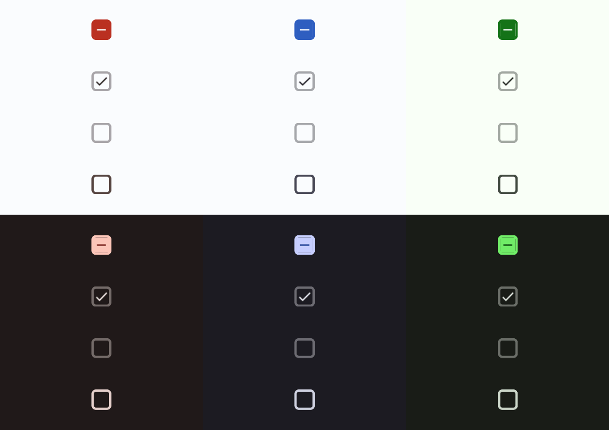

# Checkbox



A checkbox allows for true / false  / null input for multiple categories. Read more [here](https://m3.material.io/components/checkbox/overview)
# Constructors


## new
This function is a native constructor, with verbosity allowing for control over every configurable property at the cost of a less convenient calling.

### Parameters
- **onSelect**: (isSelected: boolean?) -> ()
- **initialSelection**: boolean?
- **isEnabled**: boolean
- **outlineColor**: Color3
- **fillColor**: Color3
- **iconColor**: Color3
- **disabledColor**: Color3
- **elevation**: number
- **schemeType**: Enums.SchemeType
- **fontData**: FontData
- **scale**: number


### Usage

**No Framework**
```luau
local onSelect: (isSelected: boolean?) -> () = function(isSelected: boolean?) end
local initialSelection: boolean? = nil
local isEnabled: boolean = true
local outlineColor: Color3 = Color3.new()
local fillColor: Color3 = Color3.new()
local iconColor: Color3 = Color3.new()
local disabledColor: Color3 = Color3.new()
local elevation: number = 0
local schemeType: Enums.SchemeType = Enums.SchemeType.Light
local fontData: FontData = Types.FontData.new(Font.fromEnum(Enum.Font.SourceSans), 14)
local scale: number = 1

local checkbox = Synthetic.Component.Checkbox.Fusion.new()
checkbox.OnSelect = onSelect
checkbox.InitialSelection = initialSelection
checkbox.IsEnabled = isEnabled
checkbox.OutlineColor = outlineColor
checkbox.FillColor = fillColor
checkbox.IconColor = iconColor
checkbox.DisabledColor = disabledColor
checkbox.Elevation = elevation
checkbox.SchemeType = schemeType
checkbox.FontData = fontData
checkbox.Scale = scale
```

**Fusion**
```luau
local onSelectState: Fusion.Value<(isSelected: boolean?) -> ()> = Value(function(isSelected: boolean?) end)
local initialSelection: boolean? = nil
local isEnabledState: Fusion.Value<boolean> = Value(true)
local outlineColor: Color3 = Color3.new()
local fillColorState: Fusion.Value<Color3> = Value(Color3.new())
local iconColor: Color3 = Color3.new()
local disabledColorState: Fusion.Value<Color3> = Value(Color3.new())
local elevation: number = 0
local schemeTypeState: Fusion.Value<Enums.SchemeType> = Value(Enums.SchemeType.Light)
local fontData: FontData = Types.FontData.new(Font.fromEnum(Enum.Font.SourceSans), 14)
local scaleState: Fusion.Value<number> = Value(1)

local checkbox: GuiObject = Synthetic.Component.Checkbox.Fusion.new(
	onSelectState,
	initialSelection,
	isEnabledState,
	outlineColor,
	fillColorState,
	iconColor,
	disabledColorState,
	elevation,
	schemeTypeState,
	fontData,
	scaleState
)
```
## primary / secondary / tertiary / primaryContainer / secondaryContainer / tertiaryContainer
This function is a style constructor, utilizing the "Style" type to reduce the number of parameters required for implementation.

### Parameters
- **style**: Style
- **onSelect**: (isSelected: boolean?) -> ()
- **initialSelection**: boolean?
- **elevation**: number?
- **isEnabled**: boolean?


### Usage

**No Framework**
```luau
local style: Style = Style.new(1, Enum.Font.SourceSans, "Light", Color3.new(0, 0.4, 0.7))
local onSelect: (isSelected: boolean?) -> () = function(isSelected: boolean?) end
local initialSelection: boolean? = nil
local elevation: number? = nil
local isEnabled: boolean? = nil

local checkbox = Synthetic.Component.Checkbox.Fusion.primary()
checkbox.Style = style
checkbox.OnSelect = onSelect
checkbox.InitialSelection = initialSelection
checkbox.Elevation = elevation
checkbox.IsEnabled = isEnabled
```

**Fusion**
```luau
local styleState: Fusion.Value<Style> = Value(Style.new(1, Enum.Font.SourceSans, "Light", Color3.new(0, 0.4, 0.7)))
local onSelect: (isSelected: boolean?) -> () = function(isSelected: boolean?) end
local initialSelectionState: Fusion.Value<boolean?> = Value(nil)
local elevation: number? = nil
local isEnabledState: Fusion.Value<boolean?> = Value(nil)

local checkbox: GuiObject = Synthetic.Component.Checkbox.Fusion.primary(
	styleState,
	onSelect,
	initialSelectionState,
	elevation,
	isEnabledState
)
```