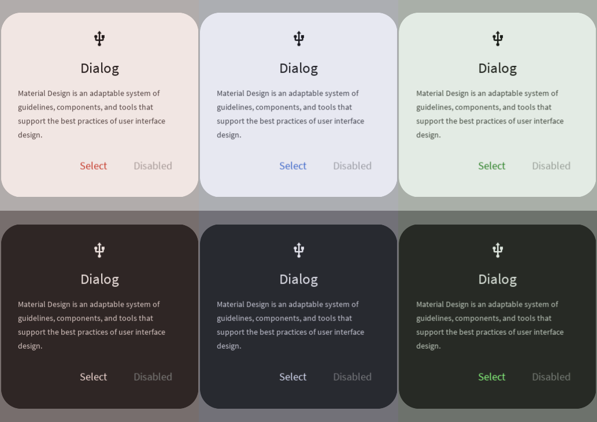

# Dialog



A prompt that allows the user to make an important decision. Read more [here](https://m3.material.io/components/dialogs/overview).
# Constructors


## new
This function is a native constructor, with verbosity allowing for control over every configurable property at the cost of a less convenient calling.

### Parameters
- **buttons**: { ButtonData }
- **icon**: ImageData?
- **headline**: string?
- **description**: string?
- **surfaceColor**: Color3
- **buttonTextColor**: Color3
- **disabledTextColor**: Color3
- **headlineColor**: Color3
- **descriptionColor**: Color3
- **scrimColor**: Color3
- **schemeType**: Enums.SchemeType
- **headlineFontData**: FontData
- **bodyFontData**: FontData
- **buttonFontData**: FontData
- **scale**: number


### Usage

**No Framework**
```luau
local buttons: { ButtonData } = {}
local icon: ImageData? = nil
local headline: string? = ""
local description: string? = ""
local surfaceColor: Color3 = Color3.new()
local buttonTextColor: Color3 = Color3.new()
local disabledTextColor: Color3 = Color3.new()
local headlineColor: Color3 = Color3.new()
local descriptionColor: Color3 = Color3.new()
local scrimColor: Color3 = Color3.new()
local schemeType: Enums.SchemeType = Enums.SchemeType.Light
local headlineFontData: FontData = Types.FontData.new(Font.fromEnum(Enum.Font.SourceSans), 14)
local bodyFontData: FontData = Types.FontData.new(Font.fromEnum(Enum.Font.SourceSans), 14)
local buttonFontData: FontData = Types.FontData.new(Font.fromEnum(Enum.Font.SourceSans), 14)
local scale: number = 1

local dialog = Synthetic.Component.Dialog.Fusion.new()
dialog.Buttons = buttons
dialog.Icon = icon
dialog.Headline = headline
dialog.Description = description
dialog.SurfaceColor = surfaceColor
dialog.ButtonTextColor = buttonTextColor
dialog.DisabledTextColor = disabledTextColor
dialog.HeadlineColor = headlineColor
dialog.DescriptionColor = descriptionColor
dialog.ScrimColor = scrimColor
dialog.SchemeType = schemeType
dialog.HeadlineFontData = headlineFontData
dialog.BodyFontData = bodyFontData
dialog.ButtonFontData = buttonFontData
dialog.Scale = scale
```

**Fusion**
```luau
local buttonsState: Fusion.Value<{ ButtonData }> = Value({})
local icon: ImageData? = nil
local headlineState: Fusion.Value<string?> = Value("")
local description: string? = ""
local surfaceColorState: Fusion.Value<Color3> = Value(Color3.new())
local buttonTextColor: Color3 = Color3.new()
local disabledTextColorState: Fusion.Value<Color3> = Value(Color3.new())
local headlineColor: Color3 = Color3.new()
local descriptionColorState: Fusion.Value<Color3> = Value(Color3.new())
local scrimColor: Color3 = Color3.new()
local schemeTypeState: Fusion.Value<Enums.SchemeType> = Value(Enums.SchemeType.Light)
local headlineFontData: FontData = Types.FontData.new(Font.fromEnum(Enum.Font.SourceSans), 14)
local bodyFontDataState: Fusion.Value<FontData> = Value(Types.FontData.new(Font.fromEnum(Enum.Font.SourceSans), 14))
local buttonFontData: FontData = Types.FontData.new(Font.fromEnum(Enum.Font.SourceSans), 14)
local scaleState: Fusion.Value<number> = Value(1)

local dialog: GuiObject = Synthetic.Component.Dialog.Fusion.new(
	buttonsState,
	icon,
	headlineState,
	description,
	surfaceColorState,
	buttonTextColor,
	disabledTextColorState,
	headlineColor,
	descriptionColorState,
	scrimColor,
	schemeTypeState,
	headlineFontData,
	bodyFontDataState,
	buttonFontData,
	scaleState
)
```

**Roact**
```luau
local dialog = Roact.createElement(Module.Roact.New, {
	buttons = {},
	icon = nil,
	headline = "",
	description = "",
	surfaceColor = Color3.new(),
	buttonTextColor = Color3.new(),
	disabledTextColor = Color3.new(),
	headlineColor = Color3.new(),
	descriptionColor = Color3.new(),
	scrimColor = Color3.new(),
	schemeType = Enums.SchemeType.Light,
	headlineFontData = Types.FontData.new(Font.fromEnum(Enum.Font.SourceSans), 14),
	bodyFontData = Types.FontData.new(Font.fromEnum(Enum.Font.SourceSans), 14),
	buttonFontData = Types.FontData.new(Font.fromEnum(Enum.Font.SourceSans), 14),
	scale = 1,
}

Roact.mount(dialog, parent)
```
## primary / secondary / tertiary
This function is a style constructor, utilizing the "Style" type to reduce the number of parameters required for implementation.

### Parameters
- **style**: Style
- **buttons**: { ButtonData }
- **icon**: ImageData?
- **headline**: string?
- **description**: string?


### Usage

**No Framework**
```luau
local style: Style = Style.new(1, Enum.Font.SourceSans, "Light", Color3.new(0, 0.4, 0.7))
local buttons: { ButtonData } = {}
local icon: ImageData? = nil
local headline: string? = ""
local description: string? = ""

local dialog = Synthetic.Component.Dialog.Fusion.primary()
dialog.Style = style
dialog.Buttons = buttons
dialog.Icon = icon
dialog.Headline = headline
dialog.Description = description
```

**Fusion**
```luau
local styleState: Fusion.Value<Style> = Value(Style.new(1, Enum.Font.SourceSans, "Light", Color3.new(0, 0.4, 0.7)))
local buttons: { ButtonData } = {}
local iconState: Fusion.Value<ImageData?> = Value(nil)
local headline: string? = ""
local descriptionState: Fusion.Value<string?> = Value("")

local dialog: GuiObject = Synthetic.Component.Dialog.Fusion.primary(
	styleState,
	buttons,
	iconState,
	headline,
	descriptionState
)
```

**Roact**
```luau
local dialog = Roact.createElement(Module.Roact.Primary, {
	style = Style.new(1, Enum.Font.SourceSans, "Light", Color3.new(0, 0.4, 0.7)),
	buttons = {},
	icon = nil,
	headline = "",
	description = "",
}

Roact.mount(dialog, parent)
```