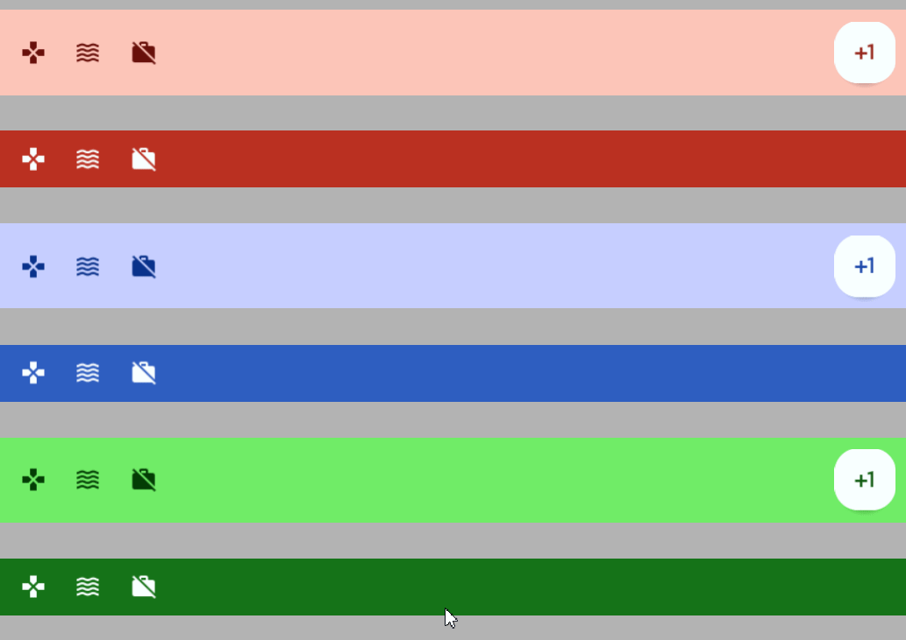

# Bottom Bar Menu



The bottom app bar allows for the display of multiple icon buttons at the bottom of the screen. Read more [here](https://m3.material.io/components/bottom-app-bar/overview).
# Constructors


## new
This function is a native constructor, with verbosity allowing for control over every configurable property at the cost of a less convenient calling.

### Parameters
- **buttons**: {ButtonData}
- **fab**: ButtonData?
- **backgroundColor**: Color3
- **iconColor**: Color3
- **fabColor**: Color3
- **fabIconColor**: Color3
- **fabShadowColor**: Color3
- **elevation**: number
- **schemeType**: Enums.SchemeType
- **fontData**: FontData
- **scale**: number


### Usage

**No Framework**
```luau
local buttons: {ButtonData} = {}
local fab: ButtonData? = nil
local backgroundColor: Color3 = Color3.new()
local iconColor: Color3 = Color3.new()
local fabColor: Color3 = Color3.new()
local fabIconColor: Color3 = Color3.new()
local fabShadowColor: Color3 = Color3.new()
local elevation: number = 0
local schemeType: Enums.SchemeType = Enums.SchemeType.Light
local fontData: FontData = Types.FontData.new(Font.fromEnum(Enum.Font.SourceSans), 14)
local scale: number = 1

local bottom = Synthetic.Component.Menu.Row.Bar.Bottom.Wrapper.new()
bottom.Buttons = buttons
bottom.Fab = fab
bottom.BackgroundColor = backgroundColor
bottom.IconColor = iconColor
bottom.FabColor = fabColor
bottom.FabIconColor = fabIconColor
bottom.FabShadowColor = fabShadowColor
bottom.Elevation = elevation
bottom.SchemeType = schemeType
bottom.FontData = fontData
bottom.Scale = scale
```

**Fusion**
```luau
local buttonsState: Fusion.Value<{ButtonData}> = Value({})
local fab: ButtonData? = nil
local backgroundColorState: Fusion.Value<Color3> = Value(Color3.new())
local iconColor: Color3 = Color3.new()
local fabColorState: Fusion.Value<Color3> = Value(Color3.new())
local fabIconColor: Color3 = Color3.new()
local fabShadowColorState: Fusion.Value<Color3> = Value(Color3.new())
local elevation: number = 0
local schemeTypeState: Fusion.Value<Enums.SchemeType> = Value(Enums.SchemeType.Light)
local fontData: FontData = Types.FontData.new(Font.fromEnum(Enum.Font.SourceSans), 14)
local scaleState: Fusion.Value<number> = Value(1)

local bottom: GuiObject = Synthetic.Component.Menu.Row.Bar.Bottom.Fusion.new(
	buttonsState,
	fab,
	backgroundColorState,
	iconColor,
	fabColorState,
	fabIconColor,
	fabShadowColorState,
	elevation,
	schemeTypeState,
	fontData,
	scaleState
)
```

**Roact**
```luau
local bottom = Roact.createElement(Module.Roact.New, {
	buttons = {},
	fab = nil,
	backgroundColor = Color3.new(),
	iconColor = Color3.new(),
	fabColor = Color3.new(),
	fabIconColor = Color3.new(),
	fabShadowColor = Color3.new(),
	elevation = 0,
	schemeType = Enums.SchemeType.Light,
	fontData = Types.FontData.new(Font.fromEnum(Enum.Font.SourceSans), 14),
	scale = 1,
})

Roact.mount(bottom, parent)
```
## primary / secondary / tertiary
This function is a style constructor, utilizing the "Style" type to reduce the number of parameters required for implementation.

### Parameters
- **style**: Style
- **buttons**: {ButtonData}
- **fab**: ButtonData?
- **elevation**: number?


### Usage

**No Framework**
```luau
local style: Style = Style.new(1, Enum.Font.SourceSans, "Light", Color3.new(0, 0.4, 0.7))
local buttons: {ButtonData} = {}
local fab: ButtonData? = nil
local elevation: number? = 0

local bottom = Synthetic.Component.Menu.Row.Bar.Bottom.Wrapper.primary()
bottom.Style = style
bottom.Buttons = buttons
bottom.Fab = fab
bottom.Elevation = elevation
```

**Fusion**
```luau
local styleState: Fusion.Value<Style> = Value(Style.new(1, Enum.Font.SourceSans, "Light", Color3.new(0, 0.4, 0.7)))
local buttons: {ButtonData} = {}
local fabState: Fusion.Value<ButtonData?> = Value(nil)
local elevation: number? = 0

local bottom: GuiObject = Synthetic.Component.Menu.Row.Bar.Bottom.Fusion.primary(
	styleState,
	buttons,
	fabState,
	elevation
)
```

**Roact**
```luau
local bottom = Roact.createElement(Module.Roact.Primary, {
	style = Style.new(1, Enum.Font.SourceSans, "Light", Color3.new(0, 0.4, 0.7)),
	buttons = {},
	fab = nil,
	elevation = 0,
})

Roact.mount(bottom, parent)
```