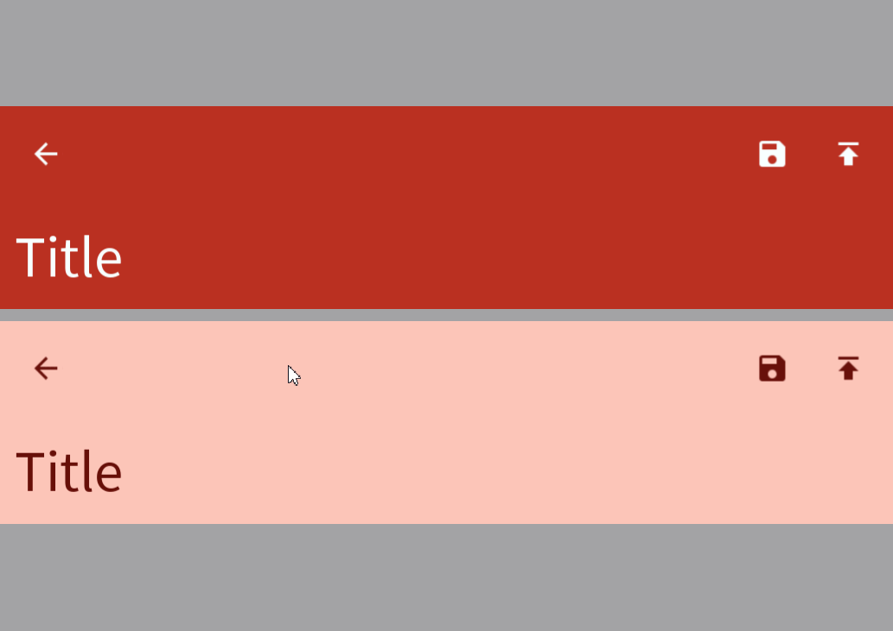

# Top Large Menu Bar



The top large menu has left aligned title text a line and a half below the buttons. Read more [here](https://m3.material.io/components/top-app-bar/overview).
# Constructors


## new
This function is a native constructor, with verbosity allowing for control over every configurable property at the cost of a less convenient calling.

### Parameters
- **title**: string
- **buttons**: {ButtonData}
- **navigation**: ButtonData?
- **backgroundColor**: Color3
- **textColor**: Color3
- **elevation**: number?
- **schemeType**: Enums.SchemeType
- **titleFontData**: FontData
- **subHeadingFontData**: FontData
- **buttonFontData**: FontData
- **scale**: number


### Usage

**No Framework**
```luau
local title: string = "Title"
local buttons: {ButtonData} = {}
local navigation: ButtonData? = nil
local backgroundColor: Color3 = Color3.new()
local textColor: Color3 = Color3.new()
local elevation: number? = nil
local schemeType: Enums.SchemeType = Enums.SchemeType.Light
local titleFontData: FontData = Types.FontData.new(Font.fromEnum(Enum.Font.SourceSans), 14)
local subHeadingFontData: FontData = Types.FontData.new(Font.fromEnum(Enum.Font.SourceSans), 14)
local buttonFontData: FontData = Types.FontData.new(Font.fromEnum(Enum.Font.SourceSans), 14)
local scale: number = 1

local large = Synthetic.Component.Menu.Row.Bar.Top.Large.Fusion.new()
large.Title = title
large.Buttons = buttons
large.Navigation = navigation
large.BackgroundColor = backgroundColor
large.TextColor = textColor
large.Elevation = elevation
large.SchemeType = schemeType
large.TitleFontData = titleFontData
large.SubHeadingFontData = subHeadingFontData
large.ButtonFontData = buttonFontData
large.Scale = scale
```

**Fusion**
```luau
local titleState: Fusion.Value<string> = Value("Title")
local buttons: {ButtonData} = {}
local navigationState: Fusion.Value<ButtonData?> = Value(nil)
local backgroundColor: Color3 = Color3.new()
local textColorState: Fusion.Value<Color3> = Value(Color3.new())
local elevation: number? = nil
local schemeTypeState: Fusion.Value<Enums.SchemeType> = Value(Enums.SchemeType.Light)
local titleFontData: FontData = Types.FontData.new(Font.fromEnum(Enum.Font.SourceSans), 14)
local subHeadingFontDataState: Fusion.Value<FontData> = Value(Types.FontData.new(Font.fromEnum(Enum.Font.SourceSans), 14))
local buttonFontData: FontData = Types.FontData.new(Font.fromEnum(Enum.Font.SourceSans), 14)
local scaleState: Fusion.Value<number> = Value(1)

local large: GuiObject = Synthetic.Component.Menu.Row.Bar.Top.Large.Fusion.new(
	titleState,
	buttons,
	navigationState,
	backgroundColor,
	textColorState,
	elevation,
	schemeTypeState,
	titleFontData,
	subHeadingFontDataState,
	buttonFontData,
	scaleState
)
```
## primary / secondary / tertiary
This function is a style constructor, utilizing the "Style" type to reduce the number of parameters required for implementation.

### Parameters
- **style**: Style
- **title**: string
- **buttons**: {ButtonData}
- **navigation**: ButtonData?
- **elevation**: number?


### Usage

**No Framework**
```luau
local style: Style = Style.new(1, Enum.Font.SourceSans, "Light", Color3.new(0, 0.4, 0.7))
local title: string = "Title"
local buttons: {ButtonData} = {}
local navigation: ButtonData? = nil
local elevation: number? = nil

local large = Synthetic.Component.Menu.Row.Bar.Top.Large.Fusion.primary()
large.Style = style
large.Title = title
large.Buttons = buttons
large.Navigation = navigation
large.Elevation = elevation
```

**Fusion**
```luau
local styleState: Fusion.Value<Style> = Value(Style.new(1, Enum.Font.SourceSans, "Light", Color3.new(0, 0.4, 0.7)))
local title: string = "Title"
local buttonsState: Fusion.Value<{ButtonData}> = Value({})
local navigation: ButtonData? = nil
local elevationState: Fusion.Value<number?> = Value(nil)

local large: GuiObject = Synthetic.Component.Menu.Row.Bar.Top.Large.Fusion.primary(
	styleState,
	title,
	buttonsState,
	navigation,
	elevationState
)
```