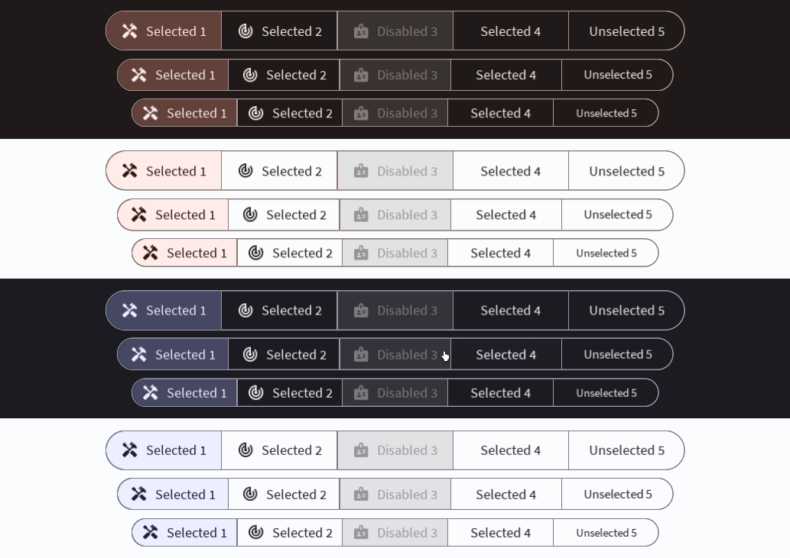

# Segmented



Segmented Buttons are a group of buttons that allow for selecting between closely related options. Read more [here](https://m3.material.io/components/segmented-buttons/overview).
# Constructors


## new
This function is a native constructor, with verbosity allowing for control over every configurable property at the cost of a less convenient calling.

### Parameters
- **options**: { OptionData }
- **density**: number
- **isMultiSelect**: boolean
- **textColor**: Color3
- **fillTextColor**: Color3
- **fillBackgroundColor**: Color3
- **outlineColor**: Color3
- **elevation**: number
- **schemeType**: Enums.SchemeType
- **fontData**: FontData
- **scale**: number


### Usage

**No Framework**
```luau
local options: { OptionData } = {}
local density: number = 0
local isMultiSelect: boolean = false
local textColor: Color3 = Color3.new()
local fillTextColor: Color3 = Color3.new()
local fillBackgroundColor: Color3 = Color3.new()
local outlineColor: Color3 = Color3.new()
local elevation: number = 0
local schemeType: Enums.SchemeType = Enums.SchemeType.Light
local fontData: FontData = Types.FontData.new(Font.fromEnum(Enum.Font.SourceSans), 14)
local scale: number = 1

local segmented = Synthetic.Component.Menu.Row.Segmented.Fusion.new()
segmented.Options = options
segmented.Density = density
segmented.IsMultiSelect = isMultiSelect
segmented.TextColor = textColor
segmented.FillTextColor = fillTextColor
segmented.FillBackgroundColor = fillBackgroundColor
segmented.OutlineColor = outlineColor
segmented.Elevation = elevation
segmented.SchemeType = schemeType
segmented.FontData = fontData
segmented.Scale = scale
```

**Fusion**
```luau
local optionsState: Fusion.Value<{ OptionData }> = Value({})
local density: number = 0
local isMultiSelectState: Fusion.Value<boolean> = Value(false)
local textColor: Color3 = Color3.new()
local fillTextColorState: Fusion.Value<Color3> = Value(Color3.new())
local fillBackgroundColor: Color3 = Color3.new()
local outlineColorState: Fusion.Value<Color3> = Value(Color3.new())
local elevation: number = 0
local schemeTypeState: Fusion.Value<Enums.SchemeType> = Value(Enums.SchemeType.Light)
local fontData: FontData = Types.FontData.new(Font.fromEnum(Enum.Font.SourceSans), 14)
local scaleState: Fusion.Value<number> = Value(1)

local segmented: GuiObject = Synthetic.Component.Menu.Row.Segmented.Fusion.new(
	optionsState,
	density,
	isMultiSelectState,
	textColor,
	fillTextColorState,
	fillBackgroundColor,
	outlineColorState,
	elevation,
	schemeTypeState,
	fontData,
	scaleState
)
```

**Roact**
```luau
local segmented = Roact.createElement(Module.Roact.New, {
	options = {},
	density = 0,
	isMultiSelect = false,
	textColor = Color3.new(),
	fillTextColor = Color3.new(),
	fillBackgroundColor = Color3.new(),
	outlineColor = Color3.new(),
	elevation = 0,
	schemeType = Enums.SchemeType.Light,
	fontData = Types.FontData.new(Font.fromEnum(Enum.Font.SourceSans), 14),
	scale = 1,
}

Roact.mount(segmented, parent)
```
## primaryContainer / secondaryContainer / tertiaryContainer
This function is a style constructor, utilizing the "Style" type to reduce the number of parameters required for implementation.

### Parameters
- **style**: Style
- **options**: { OptionData }
- **density**: number?
- **isMultiSelect**: boolean?
- **elevation**: number?


### Usage

**No Framework**
```luau
local style: Style = Style.new(1, Enum.Font.SourceSans, "Light", Color3.new(0, 0.4, 0.7))
local options: { OptionData } = {}
local density: number? = 0
local isMultiSelect: boolean? = false
local elevation: number? = 0

local segmented = Synthetic.Component.Menu.Row.Segmented.Fusion.primaryContainer()
segmented.Style = style
segmented.Options = options
segmented.Density = density
segmented.IsMultiSelect = isMultiSelect
segmented.Elevation = elevation
```

**Fusion**
```luau
local styleState: Fusion.Value<Style> = Value(Style.new(1, Enum.Font.SourceSans, "Light", Color3.new(0, 0.4, 0.7)))
local options: { OptionData } = {}
local densityState: Fusion.Value<number?> = Value(0)
local isMultiSelect: boolean? = false
local elevationState: Fusion.Value<number?> = Value(0)

local segmented: GuiObject = Synthetic.Component.Menu.Row.Segmented.Fusion.primaryContainer(
	styleState,
	options,
	densityState,
	isMultiSelect,
	elevationState
)
```

**Roact**
```luau
local segmented = Roact.createElement(Module.Roact.PrimaryContainer, {
	style = Style.new(1, Enum.Font.SourceSans, "Light", Color3.new(0, 0.4, 0.7)),
	options = {},
	density = 0,
	isMultiSelect = false,
	elevation = 0,
}

Roact.mount(segmented, parent)
```