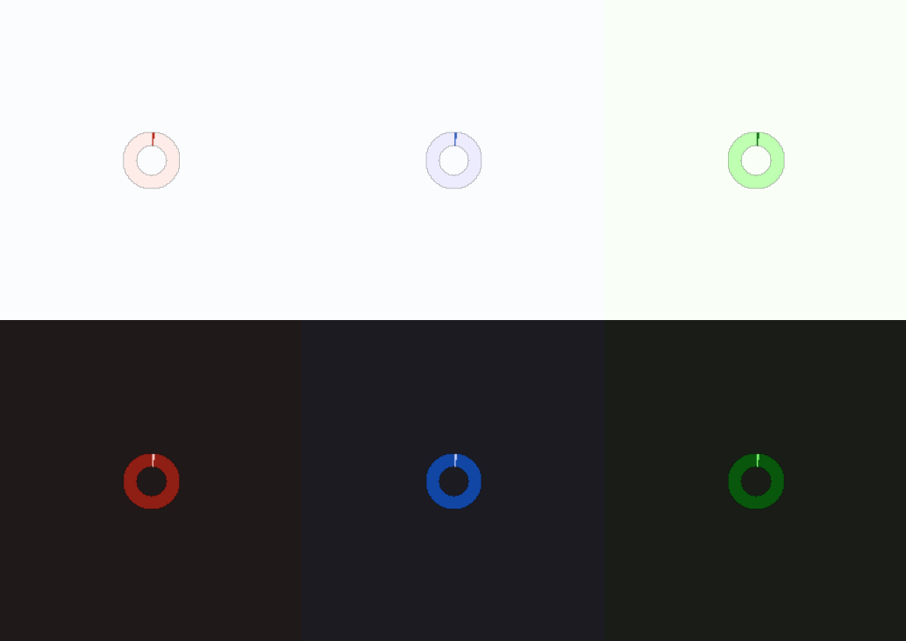

# Circular Progress Indicator



A circular progress indicator shows the user how close they are to completion of something (such as loading). Read more [here](https://m3.material.io/components/progress-indicators/overview).
# Constructors


## new
This function is a native constructor, with verbosity allowing for control over every configurable property at the cost of a less convenient calling.

### Parameters
- **progress**: number?
- **isEnabled**: boolean
- **fillColor**: Color3
- **emptyColor**: Color3
- **scale**: number


### Usage

**No Framework**
```luau
local progress: number? = nil
local isEnabled: boolean = true
local fillColor: Color3 = Color3.new()
local emptyColor: Color3 = Color3.new()
local scale: number = 1

local circular = Synthetic.Component.ProgressIndicator.Circular.Fusion.new()
circular.Progress = progress
circular.IsEnabled = isEnabled
circular.FillColor = fillColor
circular.EmptyColor = emptyColor
circular.Scale = scale
```

**Fusion**
```luau
local progressState: Fusion.Value<number?> = Value(nil)
local isEnabled: boolean = true
local fillColorState: Fusion.Value<Color3> = Value(Color3.new())
local emptyColor: Color3 = Color3.new()
local scaleState: Fusion.Value<number> = Value(1)

local circular: GuiObject = Synthetic.Component.ProgressIndicator.Circular.Fusion.new(
	progressState,
	isEnabled,
	fillColorState,
	emptyColor,
	scaleState
)
```
## primary / secondary / tertiary
This function is a style constructor, utilizing the "Style" type to reduce the number of parameters required for implementation.

### Parameters
- **style**: Style
- **progress**: number?
- **isEnabled**: boolean?


### Usage

**No Framework**
```luau
local style: Style = Style.new(1, Enum.Font.SourceSans, "Light", Color3.new(0, 0.4, 0.7))
local progress: number? = nil
local isEnabled: boolean? = true

local circular = Synthetic.Component.ProgressIndicator.Circular.Fusion.primary()
circular.Style = style
circular.Progress = progress
circular.IsEnabled = isEnabled
```

**Fusion**
```luau
local styleState: Fusion.Value<Style> = Value(Style.new(1, Enum.Font.SourceSans, "Light", Color3.new(0, 0.4, 0.7)))
local progress: number? = nil
local isEnabledState: Fusion.Value<boolean?> = Value(true)

local circular: GuiObject = Synthetic.Component.ProgressIndicator.Circular.Fusion.primary(
	styleState,
	progress,
	isEnabledState
)
```