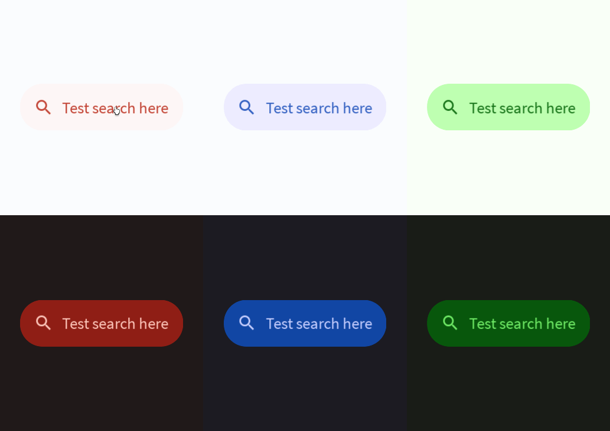

# Filled Search Bar



A filled search bar is a container that allows for dynamic text queries. Read more [here](https://m3.material.io/components/search/overview).
# Constructors


## new
This function is a native constructor, with verbosity allowing for control over every configurable property at the cost of a less convenient calling.

### Parameters
- **onInputEntered**: (input: string) -> string
- **label**: string?
- **optionSolver**: (input: string) -> { string }
- **optionConstructor**: (((key: string, onClick: (key: string) -> ()) -> GuiObject)?)
- **textColor**: Color3
- **backgroundColor**: Color3
- **elevation**: number
- **schemeType**: Enums.SchemeType
- **fontData**: FontData
- **scale**: number


### Usage

**No Framework**
```luau
local onInputEntered: (input: string) -> string = function(input: string)
return input
end
local label: string? = ""
local optionSolver: (input: string) -> { string } = function(input: string)
return {}
end
local optionConstructor: (((key: string, onClick: (key: string) -> ()) -> GuiObject)?) = nil
local textColor: Color3 = Color3.new()
local backgroundColor: Color3 = Color3.new()
local elevation: number = 0
local schemeType: Enums.SchemeType = Enums.SchemeType.Light
local fontData: FontData = Types.FontData.new(Font.fromEnum(Enum.Font.SourceSans), 14)
local scale: number = 1

local filled = Synthetic.Component.Search.Filled.Wrapper.new()
filled.OnInputEntered = onInputEntered
filled.Label = label
filled.OptionSolver = optionSolver
filled.OptionConstructor = optionConstructor
filled.TextColor = textColor
filled.BackgroundColor = backgroundColor
filled.Elevation = elevation
filled.SchemeType = schemeType
filled.FontData = fontData
filled.Scale = scale
```

**Fusion**
```luau
local onInputEnteredState: Fusion.Value<(input: string) -> string> = Value(function(input: string)
return input
end)
local label: string? = ""
local optionSolverState: Fusion.Value<(input: string) -> { string }> = Value(function(input: string)
return {}
end)
local optionConstructor: (((key: string, onClick: (key: string) -> ()) -> GuiObject)?) = nil
local textColorState: Fusion.Value<Color3> = Value(Color3.new())
local backgroundColor: Color3 = Color3.new()
local elevationState: Fusion.Value<number> = Value(0)
local schemeType: Enums.SchemeType = Enums.SchemeType.Light
local fontDataState: Fusion.Value<FontData> = Value(Types.FontData.new(Font.fromEnum(Enum.Font.SourceSans), 14))
local scale: number = 1

local filled: GuiObject = Synthetic.Component.Search.Filled.Fusion.new(
	onInputEnteredState,
	label,
	optionSolverState,
	optionConstructor,
	textColorState,
	backgroundColor,
	elevationState,
	schemeType,
	fontDataState,
	scale
)
```

**Roact**
```luau
local filled = Roact.createElement(Module.Roact.New, {
	onInputEntered = function(input: string)
return input
end,
	label = "",
	optionSolver = function(input: string)
return {}
end,
	optionConstructor = nil,
	textColor = Color3.new(),
	backgroundColor = Color3.new(),
	elevation = 0,
	schemeType = Enums.SchemeType.Light,
	fontData = Types.FontData.new(Font.fromEnum(Enum.Font.SourceSans), 14),
	scale = 1,
})

Roact.mount(filled, parent)
```
## primary / secondary / tertiary / primaryContainer / secondaryContainer / tertiaryContainer
This function is a style constructor, utilizing the "Style" type to reduce the number of parameters required for implementation.

### Parameters
- **style**: Style
- **onInputEntered**: (input: string) -> string
- **label**: string?
- **optionSolver**: (input: string) -> { string }
- **optionConstructor**: (((key: string, onClick: (key: string) -> ()) -> GuiObject)?)
- **elevation**: number?


### Usage

**No Framework**
```luau
local style: Style = Style.new(1, Enum.Font.SourceSans, "Light", Color3.new(0, 0.4, 0.7))
local onInputEntered: (input: string) -> string = function(input: string)
return input
end
local label: string? = ""
local optionSolver: (input: string) -> { string } = function(input: string)
return {}
end
local optionConstructor: (((key: string, onClick: (key: string) -> ()) -> GuiObject)?) = nil
local elevation: number? = 0

local filled = Synthetic.Component.Search.Filled.Wrapper.primary()
filled.Style = style
filled.OnInputEntered = onInputEntered
filled.Label = label
filled.OptionSolver = optionSolver
filled.OptionConstructor = optionConstructor
filled.Elevation = elevation
```

**Fusion**
```luau
local styleState: Fusion.Value<Style> = Value(Style.new(1, Enum.Font.SourceSans, "Light", Color3.new(0, 0.4, 0.7)))
local onInputEntered: (input: string) -> string = function(input: string)
return input
end
local labelState: Fusion.Value<string?> = Value("")
local optionSolver: (input: string) -> { string } = function(input: string)
return {}
end
local optionConstructorState: Fusion.Value<(((key: string, onClick: (key: string) -> ()) -> GuiObject)?)> = Value(nil)
local elevation: number? = 0

local filled: GuiObject = Synthetic.Component.Search.Filled.Fusion.primary(
	styleState,
	onInputEntered,
	labelState,
	optionSolver,
	optionConstructorState,
	elevation
)
```

**Roact**
```luau
local filled = Roact.createElement(Module.Roact.Primary, {
	style = Style.new(1, Enum.Font.SourceSans, "Light", Color3.new(0, 0.4, 0.7)),
	onInputEntered = function(input: string)
return input
end,
	label = "",
	optionSolver = function(input: string)
return {}
end,
	optionConstructor = nil,
	elevation = 0,
})

Roact.mount(filled, parent)
```