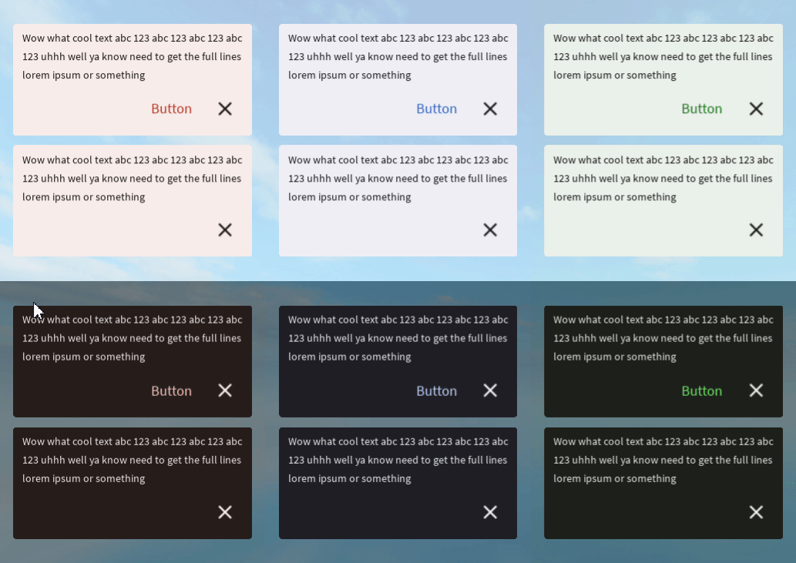

# Large Snackbar



A large snackbar is a multi-line notification pop up that sometimes has buttons. Read more [here](https://m3.material.io/components/snackbar/overview).
# Constructors


## new
This function is a native constructor, with verbosity allowing for control over every configurable property at the cost of a less convenient calling.

### Parameters
- **text**: string
- **buttonText**: string?
- **onButtonClick**: ((() -> ())?)
- **onCloseClick**: ((() -> ())?)
- **textColor**: Color3
- **buttonTextColor**: Color3
- **backgroundColor**: Color3
- **elevation**: number
- **schemeType**: Enums.SchemeType
- **fontData**: FontData
- **scale**: number


### Usage

**No Framework**
```luau
local text: string = ""
local buttonText: string? = "Action"
local onButtonClick: ((() -> ())?) = function() end
local onCloseClick: ((() -> ())?) = function() end
local textColor: Color3 = Color3.new()
local buttonTextColor: Color3 = Color3.new()
local backgroundColor: Color3 = Color3.new()
local elevation: number = 0
local schemeType: Enums.SchemeType = Enums.SchemeType.Light
local fontData: FontData = Types.FontData.new(Font.fromEnum(Enum.Font.SourceSans), 14)
local scale: number = 1

local large = Synthetic.Component.Snackbar.Large.Fusion.new()
large.Text = text
large.ButtonText = buttonText
large.OnButtonClick = onButtonClick
large.OnCloseClick = onCloseClick
large.TextColor = textColor
large.ButtonTextColor = buttonTextColor
large.BackgroundColor = backgroundColor
large.Elevation = elevation
large.SchemeType = schemeType
large.FontData = fontData
large.Scale = scale
```

**Fusion**
```luau
local textState: Fusion.Value<string> = Value("")
local buttonText: string? = "Action"
local onButtonClickState: Fusion.Value<((() -> ())?)> = Value(function() end)
local onCloseClick: ((() -> ())?) = function() end
local textColorState: Fusion.Value<Color3> = Value(Color3.new())
local buttonTextColor: Color3 = Color3.new()
local backgroundColorState: Fusion.Value<Color3> = Value(Color3.new())
local elevation: number = 0
local schemeTypeState: Fusion.Value<Enums.SchemeType> = Value(Enums.SchemeType.Light)
local fontData: FontData = Types.FontData.new(Font.fromEnum(Enum.Font.SourceSans), 14)
local scaleState: Fusion.Value<number> = Value(1)

local large: GuiObject = Synthetic.Component.Snackbar.Large.Fusion.new(
	textState,
	buttonText,
	onButtonClickState,
	onCloseClick,
	textColorState,
	buttonTextColor,
	backgroundColorState,
	elevation,
	schemeTypeState,
	fontData,
	scaleState
)
```
## surfaceContainer / primaryContainer / secondaryContainer / tertiaryContainer
This function is a style constructor, utilizing the "Style" type to reduce the number of parameters required for implementation.

### Parameters
- **style**: Style
- **text**: string
- **buttonText**: string?
- **onButtonClick**: ((() -> ())?)
- **onCloseClick**: ((() -> ())?)
- **elevation**: number?


### Usage

**No Framework**
```luau
local style: Style = Style.new(1, Enum.Font.SourceSans, "Light", Color3.new(0, 0.4, 0.7))
local text: string = ""
local buttonText: string? = "Action"
local onButtonClick: ((() -> ())?) = function() end
local onCloseClick: ((() -> ())?) = function() end
local elevation: number? = 0

local large = Synthetic.Component.Snackbar.Large.Fusion.surfaceContainer()
large.Style = style
large.Text = text
large.ButtonText = buttonText
large.OnButtonClick = onButtonClick
large.OnCloseClick = onCloseClick
large.Elevation = elevation
```

**Fusion**
```luau
local styleState: Fusion.Value<Style> = Value(Style.new(1, Enum.Font.SourceSans, "Light", Color3.new(0, 0.4, 0.7)))
local text: string = ""
local buttonTextState: Fusion.Value<string?> = Value("Action")
local onButtonClick: ((() -> ())?) = function() end
local onCloseClickState: Fusion.Value<((() -> ())?)> = Value(function() end)
local elevation: number? = 0

local large: GuiObject = Synthetic.Component.Snackbar.Large.Fusion.surfaceContainer(
	styleState,
	text,
	buttonTextState,
	onButtonClick,
	onCloseClickState,
	elevation
)
```