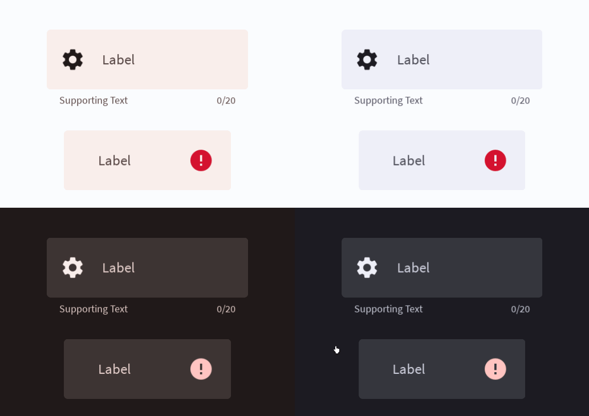

# Filled Text Field



A filled text field is a container with a text input area. Read more [here](https://m3.material.io/components/text-fields/overview).
# Constructors


## new
This function is a native constructor, with verbosity allowing for control over every configurable property at the cost of a less convenient calling.

### Parameters
- **onSubmit**: ((text: string?) -> string?)
- **onInput**: ((text: string?) -> string?)
- **initialText**: string?
- **isEnabled**: boolean
- **isError**: boolean
- **label**: string
- **characterLimit**: number?
- **supportingText**: string?
- **icon**: ImageData?
- **backgroundColor**: Color3
- **hightlightColor**: Color3
- **errorColor**: Color3
- **borderColor**: Color3
- **textColor**: Color3
- **labelColor**: Color3
- **elevation**: number
- **schemeType**: Enums.SchemeType
- **bodyFontData**: FontData
- **supportFontData**: FontData
- **scale**: number


### Usage

**No Framework**
```luau
local onSubmit: ((text: string?) -> string?) = function(text: string?)
return text
end
local onInput: ((text: string?) -> string?) = function(text: string?)
return text
end
local initialText: string? = nil
local isEnabled: boolean = true
local isError: boolean = false
local label: string = "Label"
local characterLimit: number? = nil
local supportingText: string? = nil
local icon: ImageData? = nil
local backgroundColor: Color3 = Color3.new()
local hightlightColor: Color3 = Color3.new()
local errorColor: Color3 = Color3.new()
local borderColor: Color3 = Color3.new()
local textColor: Color3 = Color3.new()
local labelColor: Color3 = Color3.new()
local elevation: number = 0
local schemeType: Enums.SchemeType = Enums.SchemeType.Light
local bodyFontData: FontData = Types.FontData.new(Font.fromEnum(Enum.Font.SourceSans), 14)
local supportFontData: FontData = Types.FontData.new(Font.fromEnum(Enum.Font.SourceSans), 14)
local scale: number = 1

local filled = Synthetic.Component.TextField.Filled.Fusion.new()
filled.OnSubmit = onSubmit
filled.OnInput = onInput
filled.InitialText = initialText
filled.IsEnabled = isEnabled
filled.IsError = isError
filled.Label = label
filled.CharacterLimit = characterLimit
filled.SupportingText = supportingText
filled.Icon = icon
filled.BackgroundColor = backgroundColor
filled.HightlightColor = hightlightColor
filled.ErrorColor = errorColor
filled.BorderColor = borderColor
filled.TextColor = textColor
filled.LabelColor = labelColor
filled.Elevation = elevation
filled.SchemeType = schemeType
filled.BodyFontData = bodyFontData
filled.SupportFontData = supportFontData
filled.Scale = scale
```

**Fusion**
```luau
local onSubmitState: Fusion.Value<((text: string?) -> string?)> = Value(function(text: string?)
return text
end)
local onInput: ((text: string?) -> string?) = function(text: string?)
return text
end
local initialTextState: Fusion.Value<string?> = Value(nil)
local isEnabled: boolean = true
local isErrorState: Fusion.Value<boolean> = Value(false)
local label: string = "Label"
local characterLimitState: Fusion.Value<number?> = Value(nil)
local supportingText: string? = nil
local iconState: Fusion.Value<ImageData?> = Value(nil)
local backgroundColor: Color3 = Color3.new()
local hightlightColorState: Fusion.Value<Color3> = Value(Color3.new())
local errorColor: Color3 = Color3.new()
local borderColorState: Fusion.Value<Color3> = Value(Color3.new())
local textColor: Color3 = Color3.new()
local labelColorState: Fusion.Value<Color3> = Value(Color3.new())
local elevation: number = 0
local schemeTypeState: Fusion.Value<Enums.SchemeType> = Value(Enums.SchemeType.Light)
local bodyFontData: FontData = Types.FontData.new(Font.fromEnum(Enum.Font.SourceSans), 14)
local supportFontDataState: Fusion.Value<FontData> = Value(Types.FontData.new(Font.fromEnum(Enum.Font.SourceSans), 14))
local scale: number = 1

local filled: GuiObject = Synthetic.Component.TextField.Filled.Fusion.new(
	onSubmitState,
	onInput,
	initialTextState,
	isEnabled,
	isErrorState,
	label,
	characterLimitState,
	supportingText,
	iconState,
	backgroundColor,
	hightlightColorState,
	errorColor,
	borderColorState,
	textColor,
	labelColorState,
	elevation,
	schemeTypeState,
	bodyFontData,
	supportFontDataState,
	scale
)
```
## primary / secondary / tertiary
This function is a style constructor, utilizing the "Style" type to reduce the number of parameters required for implementation.

### Parameters
- **style**: Style
- **onSubmit**: ((text: string?) -> string?)
- **label**: string
- **initialText**: string?
- **onInput**: (((text: string?) -> string?)?)
- **supportingText**: string?
- **icon**: ImageData?
- **characterLimit**: number?
- **isError**: boolean?
- **elevation**: number?
- **isEnabled**: boolean?


### Usage

**No Framework**
```luau
local style: Style = Style.new(1, Enum.Font.SourceSans, "Light", Color3.new(0, 0.4, 0.7))
local onSubmit: ((text: string?) -> string?) = function(text: string?)
return text
end
local label: string = "Label"
local initialText: string? = nil
local onInput: (((text: string?) -> string?)?) = nil
local supportingText: string? = nil
local icon: ImageData? = nil
local characterLimit: number? = nil
local isError: boolean? = nil
local elevation: number? = nil
local isEnabled: boolean? = nil

local filled = Synthetic.Component.TextField.Filled.Fusion.primary()
filled.Style = style
filled.OnSubmit = onSubmit
filled.Label = label
filled.InitialText = initialText
filled.OnInput = onInput
filled.SupportingText = supportingText
filled.Icon = icon
filled.CharacterLimit = characterLimit
filled.IsError = isError
filled.Elevation = elevation
filled.IsEnabled = isEnabled
```

**Fusion**
```luau
local styleState: Fusion.Value<Style> = Value(Style.new(1, Enum.Font.SourceSans, "Light", Color3.new(0, 0.4, 0.7)))
local onSubmit: ((text: string?) -> string?) = function(text: string?)
return text
end
local labelState: Fusion.Value<string> = Value("Label")
local initialText: string? = nil
local onInputState: Fusion.Value<(((text: string?) -> string?)?)> = Value(nil)
local supportingText: string? = nil
local iconState: Fusion.Value<ImageData?> = Value(nil)
local characterLimit: number? = nil
local isErrorState: Fusion.Value<boolean?> = Value(nil)
local elevation: number? = nil
local isEnabledState: Fusion.Value<boolean?> = Value(nil)

local filled: GuiObject = Synthetic.Component.TextField.Filled.Fusion.primary(
	styleState,
	onSubmit,
	labelState,
	initialText,
	onInputState,
	supportingText,
	iconState,
	characterLimit,
	isErrorState,
	elevation,
	isEnabledState
)
```