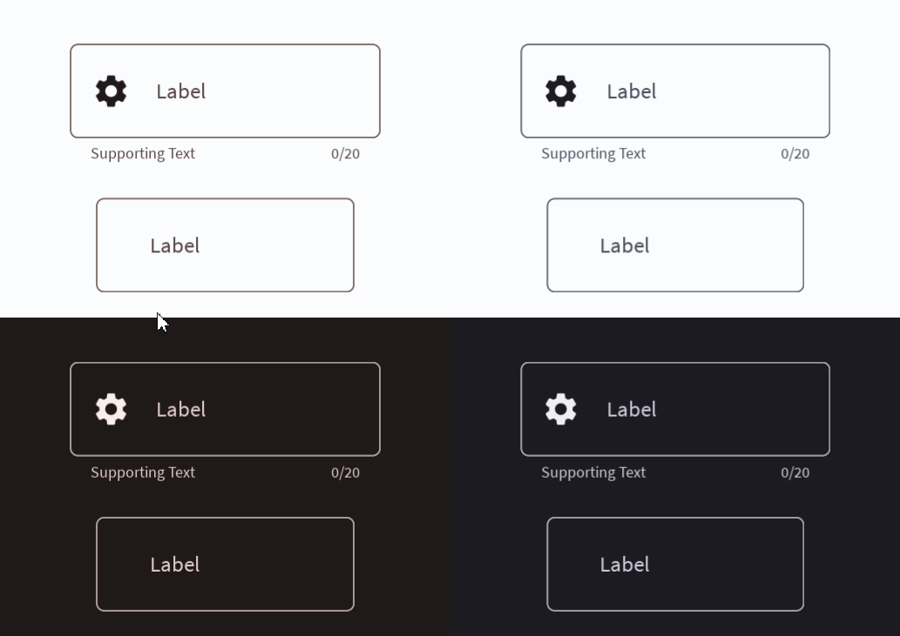

# Outlined Text Field



An outlined text field uses lines instead of a container to display the boundaries of the text input area. Read more [here](https://m3.material.io/components/text-fields/overview).
# Constructors


## new
This function is a native constructor, with verbosity allowing for control over every configurable property at the cost of a less convenient calling.

### Parameters
- **onSubmit**: ((text: string?) -> string?)
- **onInput**: ((text: string?) -> string?)
- **initialText**: string?
- **isEnabled**: boolean
- **isError**: boolean
- **label**: string
- **characterLimit**: number?
- **supportingText**: string?
- **icon**: ImageData?
- **hightlightColor**: Color3
- **errorColor**: Color3
- **borderColor**: Color3
- **textColor**: Color3
- **labelColor**: Color3
- **elevation**: number
- **schemeType**: Enums.SchemeType
- **bodyFontData**: FontData
- **supportFontData**: FontData
- **scale**: number


### Usage

**No Framework**
```luau
local onSubmit: ((text: string?) -> string?) = function(text: string?)
return text
end
local onInput: ((text: string?) -> string?) = function(text: string?)
return text
end
local initialText: string? = ""
local isEnabled: boolean = true
local isError: boolean = false
local label: string = "Label"
local characterLimit: number? = nil
local supportingText: string? = ""
local icon: ImageData? = nil
local hightlightColor: Color3 = Color3.new()
local errorColor: Color3 = Color3.new()
local borderColor: Color3 = Color3.new()
local textColor: Color3 = Color3.new()
local labelColor: Color3 = Color3.new()
local elevation: number = 0
local schemeType: Enums.SchemeType = Enums.SchemeType.Light
local bodyFontData: FontData = Types.FontData.new(Font.fromEnum(Enum.Font.SourceSans), 14)
local supportFontData: FontData = Types.FontData.new(Font.fromEnum(Enum.Font.SourceSans), 14)
local scale: number = 1

local outlined = Synthetic.Component.TextField.Outlined.Fusion.new()
outlined.OnSubmit = onSubmit
outlined.OnInput = onInput
outlined.InitialText = initialText
outlined.IsEnabled = isEnabled
outlined.IsError = isError
outlined.Label = label
outlined.CharacterLimit = characterLimit
outlined.SupportingText = supportingText
outlined.Icon = icon
outlined.HightlightColor = hightlightColor
outlined.ErrorColor = errorColor
outlined.BorderColor = borderColor
outlined.TextColor = textColor
outlined.LabelColor = labelColor
outlined.Elevation = elevation
outlined.SchemeType = schemeType
outlined.BodyFontData = bodyFontData
outlined.SupportFontData = supportFontData
outlined.Scale = scale
```

**Fusion**
```luau
local onSubmitState: Fusion.Value<((text: string?) -> string?)> = Value(function(text: string?)
return text
end)
local onInput: ((text: string?) -> string?) = function(text: string?)
return text
end
local initialTextState: Fusion.Value<string?> = Value("")
local isEnabled: boolean = true
local isErrorState: Fusion.Value<boolean> = Value(false)
local label: string = "Label"
local characterLimitState: Fusion.Value<number?> = Value(nil)
local supportingText: string? = ""
local iconState: Fusion.Value<ImageData?> = Value(nil)
local hightlightColor: Color3 = Color3.new()
local errorColorState: Fusion.Value<Color3> = Value(Color3.new())
local borderColor: Color3 = Color3.new()
local textColorState: Fusion.Value<Color3> = Value(Color3.new())
local labelColor: Color3 = Color3.new()
local elevationState: Fusion.Value<number> = Value(0)
local schemeType: Enums.SchemeType = Enums.SchemeType.Light
local bodyFontDataState: Fusion.Value<FontData> = Value(Types.FontData.new(Font.fromEnum(Enum.Font.SourceSans), 14))
local supportFontData: FontData = Types.FontData.new(Font.fromEnum(Enum.Font.SourceSans), 14)
local scaleState: Fusion.Value<number> = Value(1)

local outlined: GuiObject = Synthetic.Component.TextField.Outlined.Fusion.new(
	onSubmitState,
	onInput,
	initialTextState,
	isEnabled,
	isErrorState,
	label,
	characterLimitState,
	supportingText,
	iconState,
	hightlightColor,
	errorColorState,
	borderColor,
	textColorState,
	labelColor,
	elevationState,
	schemeType,
	bodyFontDataState,
	supportFontData,
	scaleState
)
```

**Roact**
```luau
local outlined = Roact.createElement(Module.Roact.New, {
	onSubmit = function(text: string?)
return text
end,
	onInput = function(text: string?)
return text
end,
	initialText = "",
	isEnabled = true,
	isError = false,
	label = "Label",
	characterLimit = nil,
	supportingText = "",
	icon = nil,
	hightlightColor = Color3.new(),
	errorColor = Color3.new(),
	borderColor = Color3.new(),
	textColor = Color3.new(),
	labelColor = Color3.new(),
	elevation = 0,
	schemeType = Enums.SchemeType.Light,
	bodyFontData = Types.FontData.new(Font.fromEnum(Enum.Font.SourceSans), 14),
	supportFontData = Types.FontData.new(Font.fromEnum(Enum.Font.SourceSans), 14),
	scale = 1,
}

Roact.mount(outlined, parent)
```
## primary / secondary / tertiary
This function is a style constructor, utilizing the "Style" type to reduce the number of parameters required for implementation.

### Parameters
- **style**: Style
- **onSubmit**: ((text: string?) -> string?)
- **label**: string
- **initialText**: string?
- **onInput**: (((text: string?) -> string?)?)
- **supportingText**: string?
- **icon**: ImageData?
- **characterLimit**: number?
- **isError**: boolean?
- **elevation**: number?
- **isEnabled**: boolean?


### Usage

**No Framework**
```luau
local style: Style = Style.new(1, Enum.Font.SourceSans, "Light", Color3.new(0, 0.4, 0.7))
local onSubmit: ((text: string?) -> string?) = function(text: string?)
return text
end
local label: string = "Label"
local initialText: string? = ""
local onInput: (((text: string?) -> string?)?) = function(text: string?)
return text
end
local supportingText: string? = ""
local icon: ImageData? = nil
local characterLimit: number? = nil
local isError: boolean? = false
local elevation: number? = 0
local isEnabled: boolean? = true

local outlined = Synthetic.Component.TextField.Outlined.Fusion.primary()
outlined.Style = style
outlined.OnSubmit = onSubmit
outlined.Label = label
outlined.InitialText = initialText
outlined.OnInput = onInput
outlined.SupportingText = supportingText
outlined.Icon = icon
outlined.CharacterLimit = characterLimit
outlined.IsError = isError
outlined.Elevation = elevation
outlined.IsEnabled = isEnabled
```

**Fusion**
```luau
local styleState: Fusion.Value<Style> = Value(Style.new(1, Enum.Font.SourceSans, "Light", Color3.new(0, 0.4, 0.7)))
local onSubmit: ((text: string?) -> string?) = function(text: string?)
return text
end
local labelState: Fusion.Value<string> = Value("Label")
local initialText: string? = ""
local onInputState: Fusion.Value<(((text: string?) -> string?)?)> = Value(function(text: string?)
return text
end)
local supportingText: string? = ""
local iconState: Fusion.Value<ImageData?> = Value(nil)
local characterLimit: number? = nil
local isErrorState: Fusion.Value<boolean?> = Value(false)
local elevation: number? = 0
local isEnabledState: Fusion.Value<boolean?> = Value(true)

local outlined: GuiObject = Synthetic.Component.TextField.Outlined.Fusion.primary(
	styleState,
	onSubmit,
	labelState,
	initialText,
	onInputState,
	supportingText,
	iconState,
	characterLimit,
	isErrorState,
	elevation,
	isEnabledState
)
```

**Roact**
```luau
local outlined = Roact.createElement(Module.Roact.Primary, {
	style = Style.new(1, Enum.Font.SourceSans, "Light", Color3.new(0, 0.4, 0.7)),
	onSubmit = function(text: string?)
return text
end,
	label = "Label",
	initialText = "",
	onInput = function(text: string?)
return text
end,
	supportingText = "",
	icon = nil,
	characterLimit = nil,
	isError = false,
	elevation = 0,
	isEnabled = true,
}

Roact.mount(outlined, parent)
```